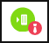

# Cuentas
Cloud App Security le ofrece la posibilidad de supervisar las cuentas de sus aplicaciones conectadas. Después de conectar Cloud App Security a una aplicación mediante el conector de aplicaciones, Cloud App Security lee la información de la cuenta asociada a las aplicaciones conectadas. La página Cuentas permite investigar esas cuentas, los permisos, los grupos a los que pertenecen, sus alias y las aplicaciones que usan. Además, cuando Cloud App Security detecta una cuenta nueva que no se había detectado previamente en ninguna de las aplicaciones conectadas (por ejemplo, en la actividad o el uso compartido de archivos), la cuenta se agrega a la lista de cuentas de la aplicación en cuestión. Esto le permite supervisar la actividad de los usuarios externos que interactúan con sus aplicaciones en la nube.

La página **Cuentas** se puede filtrar para que se puedan buscar cuentas concretas y para profundizar en diferentes tipos de cuentas. Por ejemplo, puede filtrar por todas las cuentas externas a las que no se haya accedido desde el año pasado. 

La página **Cuentas** le permite investigar fácilmente las cuentas para detectar problemas como los siguientes:  

-   Compruebe si alguna cuenta ha estado inactiva en un servicio determinado durante mucho tiempo, ya que quizás se deba revocar la licencia de ese usuario en ese servicio.  
-   Puede filtrar por la lista de usuarios con permisos de administrador.  

-   Puede buscar usuarios que ya no formen parte de su organización, pero que es posible que aún tengan cuentas activas.  

-   Puede realizar acciones de gobierno en la cuenta, como suspender una aplicación o ir a la página de configuración de la cuenta. Para obtener una lista completa de acciones de gobierno, consulte el [registro de gobierno](governance-actions.md).
    
-   Puede ver qué cuentas están incluidas en cada grupo de usuarios.  

-   Puede ver a qué aplicaciones accede cada cuenta y qué aplicaciones se han eliminado en cuentas concretas.
    

## Filtros de cuenta
A continuación se muestra una lista de los filtros de cuenta que se pueden aplicar. La mayoría de los filtros admiten varios valores, así como NOT, para proporcionarle una herramienta muy eficaz para la creación de directivas.  
  
- **Nombre de cuenta**: el nombre de cuenta es el alias principal del usuario, pero se admiten otros identificadores de otras cuentas Microsoft (Office 365 y Azure Active Directory), como direcciones proxy, alias o SID, que se consolidan bajo el alias principal.

- **Afiliación**: la afiliación será **Interna** o **Externa**. Para establecer qué usuarios y cuentas son internos, en **Configuración** asegúrese de establecer el **intervalo de direcciones IP** de la organización interna. En caso de que la cuenta tenga permisos de administrador, el icono de la tabla Cuentas, el correspondiente al de , aparecerá con un lazo rojo.

- **Aplicación**: puede filtrar por cualquier aplicación conectada a la API y que esté en uso en las cuentas de la organización.

- **Dominio**: permite filtrar por usuarios de dominios concretos.

- **Visto por última vez**: el filtro **Visto por última vez** permite buscar cuentas que estén inactivas y cuyos usuarios no hayan tenido actividad durante un tiempo.

- **Organización o departamento**: permite filtrar por miembros de determinados grupos organizativos definidos en sus aplicaciones conectadas.

- **Grupo de usuarios**: permite filtrar por miembros de grupos de usuarios de Cloud App Security, tanto grupos de usuarios integrados como importados.

## Consulte también  
[Actividades diarias para proteger el entorno de nube](daily-activities-to-protect-your-cloud-environment.md)   
[Para obtener soporte técnico, visite la página de soporte técnico asistido de Cloud App Security.](http://support.microsoft.com/oas/default.aspx?prid=16031)   
[Los clientes Premier también pueden elegir Cloud App Security directamente desde el Portal Premier.](https://premier.microsoft.com/)  
  
  