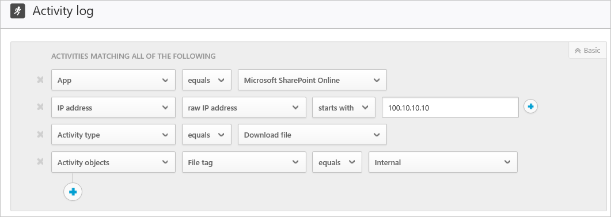

# Actividades

*Se aplica a: Microsoft Cloud App Security*

Microsoft Cloud App Security le ofrece visibilidad de todas las actividades de las aplicaciones conectadas. Después de conectar Cloud App Security con una aplicación mediante el conector de aplicaciones, Cloud App Security examina todas las actividades que se han producido (el período de tiempo de examen retroactivo varía según la aplicación) y después se actualiza constantemente con nuevas actividades.

> [!NOTE]
> Para obtener una lista completa de las actividades de Office 365 supervisadas por Cloud App Security, consulte [Buscar en el registro de auditoría del Centro de seguridad y cumplimiento de Office 365](https://support.office.com/article/Search-the-audit-log-in-the-Office-365-Security-Compliance-Center-0d4d0f35-390b-4518-800e-0c7ec95e946c?ui=en-US&rs=en-US&ad=US#ID0EABAAA=Audited_activities).

Se puede filtrar el **registro de actividades** para que pueda buscar actividades específicas. Cree directivas basadas en las actividades y después definir sobre qué quiere recibir alertas y actuar en consecuencia. También puede buscar actividades realizadas en determinados archivos. El tipo de actividades y la información que obtenemos de cada actividad dependen de la aplicación y de qué tipo de datos puede proporcionar la aplicación.

Por ejemplo, puede usar el **registro de actividades** para buscar usuarios de la organización que usan sistemas operativos o exploradores que no están actualizados de la siguiente forma: después de conectar una aplicación a Cloud App Security en la página del **registro de actividades**, use el filtro avanzado y seleccione **User agent tag** (Etiqueta de agente de usuario). Después, seleccione **Outdated browser** (Explorador obsoleto) u **Outdated operating system** (Sistema operativo obsoleto).

El filtro básico proporciona excelentes herramientas para empezar a filtrar sus actividades.

Para profundizar en actividades más específicas, puede ampliar el filtro básico haciendo clic en **Advanced** (Opciones avanzadas).

> [!NOTE]
> La etiqueta Heredado se agrega a cualquier directiva de actividad que use el filtro de "usuario" anterior. Este filtro seguirá funcionando como de costumbre. Si quiere quitar la etiqueta Heredado, puede quitar el filtro y volver a agregarlo con el nuevo filtro **Nombre de usuario**.

## El cajón de actividades

### Trabajo con el cajón de actividades

Para ver más información sobre cada actividad, haga clic en la misma actividad en el registro de actividades. Se abrirá el cajón de actividades, que proporciona las siguientes acciones e información adicionales para cada actividad:
- Directivas coincidentes: haga clic en el vínculo Directivas coincidentes para ver una lista de las directivas con las que coincide esta actividad.

- Ver datos sin procesar: haga clic en la opción para ver los datos sin procesar para ver los datos reales recibidos desde la aplicación.

- Usuario: haga clic en el usuario para ver la página correspondiente al usuario que realizó la actividad.

- Tipo de dispositivo: haga clic en el tipo de dispositivo para ver los datos sin procesar del agente de usuario.

- Ubicación: haga clic en la ubicación para ver la ubicación en los mapas de Bing.

- Categoría y etiquetas de la dirección IP: haga clic en la etiqueta IP para ver la lista de etiquetas IP que se encuentran en esta actividad. Después, puede filtrar por todas las actividades que coinciden con esta etiqueta.

Los campos del cajón de actividades proporcionan vínculos contextuales a actividades adicionales y exploran en profundidad lo que desea realizar desde el cajón directamente. Por ejemplo, si mueve el cursor junto a la categoría de dirección IP, puede utilizar el icono Filtrar  para agregar la dirección IP inmediatamente al filtro de la página actual. También puede utilizar el icono de engranaje de configuración  que aparece para llegar directamente a la página de configuración necesaria para modificar la configuración de uno de los campos, como **Grupos de usuarios**.

También puede usar los iconos de la parte superior de la pestaña para:
- Ver las actividades del mismo tipo
- Ver todas las actividades del mismo usuario
- Ver las actividades de la misma dirección IP
- Ver las actividades de la misma ubicación geográfica
- Ver las actividades del mismo período (48 horas)

Para obtener una lista de las acciones de control disponibles, vea [Acciones de control de actividades](governance-actions.md#activity-governance-actions).

#### Información de usuario

La experiencia de investigación incluye conclusiones sobre el usuario activo. Con un solo clic, puede obtener una descripción detallada del usuario, incluida la ubicación desde la que se ha conectado, con cuántas alertas abiertas está relacionado e información sobre sus metadatos.

Para ver la información de usuario:

1. Haga clic en la actividad en el **Registro de actividades**.

2. Después, haga clic en la pestaña **Usuario**.  
Al hacer clic se abre la pestaña **Usuario** del cajón de actividades, que contiene estas conclusiones sobre el usuario:
    - **Alertas abiertas**: número de alertas abiertas relacionadas con el usuario.
    - **Coincidencias**: número de coincidencias de directa para archivos que pertenecen al usuario.
    - **Actividades**: número de actividades realizadas por el usuario durante los últimos 30 días.
    - **Países**: número de países desde los que se ha conectado el usuario durante los últimos 30 días.
    - **ISP**: número de ISP desde los que se ha conectado el usuario durante los últimos 30 días.
    - **Direcciones IP**: número de direcciones IP desde las que se ha conectado el usuario durante los últimos 30 días.

#### Información de dirección IP

Debido a que la información de dirección IP es fundamental para casi todas las investigaciones, puede ver información detallada sobre las direcciones IP en el cajón de actividades. Desde una actividad específica, puede hacer clic en la pestaña de dirección IP para ver los datos consolidados sobre la dirección IP, incluido el número de alertas abiertas para la dirección IP específica, un gráfico de tendencias de la actividad reciente y un mapa de ubicación. Esto permite explorar en profundidad al investigar alertas de viajes imposibles, por ejemplo. Puede comprender fácilmente dónde se usó la dirección IP y si participó en actividades sospechosas o no. También puede realizar acciones directamente en el cajón de direcciones IP que le permiten etiquetar una dirección IP como de riesgo, VPN o corporativa para facilitar una investigación futura y la creación de directivas.

Para ver la información de dirección IP:

1. Haga clic en la actividad en el **Registro de actividades**.

2. Luego haga clic en la pestaña **Dirección IP**.  
Se abrirá la pestaña **Dirección IP** del espacio de actividades, que ofrece la información siguiente sobre la dirección IP:
    - **Alertas abiertas**: número de alertas abiertas relacionadas con la dirección IP.
    - **Actividades**: número de actividades realizadas por la dirección IP durante los últimos 30 días.
    - **Ubicación de IP**: ubicaciones geográficas desde las cuales se conectó la dirección IP durante los últimos 30 días.
    - **Actividades**: número de actividades realizadas desde esta dirección IP durante los últimos 30 días.
    - **Actividades administrativas**: número de actividades administrativas realizadas desde esta dirección IP durante los últimos 30 días.
    - Puede realizar las siguientes acciones en la dirección IP:
        - Etiquetar como IP de empresa y agregar a la lista de permitidas
        - Etiquetar como dirección IP de VPN y agregar a la lista de permitidas
        - Etiquetar como IP de riesgo y agregar a la lista de bloqueadas

   >[!NOTE]
   > Cuando una dirección IP se etiqueta como corporativa, esto se refleja en el portal y se excluyen las direcciones IP del desencadenamiento de detecciones específicas (por ejemplo, viaje imposible) ya que estas direcciones IP se consideran de confianza.

## Exportar actividades 

Puede exportar todas las actividades de usuario a un archivo CSV.

En el **Registro de actividad**, en la esquina superior derecha, haga clic en el botón **Exportar**.

[!INCLUDE [Handle personal data](../includes/gdpr-intro-sentence.md)]

## Pasos siguientes

> [!div class="nextstepaction"]
> [Actividades diarias para proteger el entorno de nube](daily-activities-to-protect-your-cloud-environment.md)

[!INCLUDE [Open support ticket](includes/support.md)]
