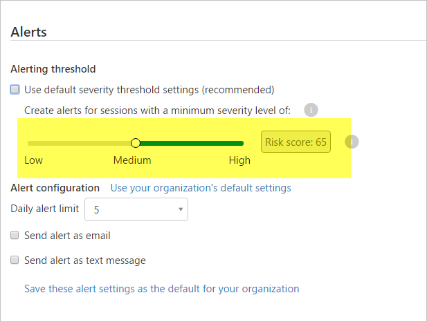

# Directiva de detección de anomalías
En este artículo se proporciona información de referencia sobre directivas, se ofrecen explicaciones sobre cada tipo de directiva y se detallan los campos que se pueden configurar para cada directiva.  
 
Cloud App Security tiene un período de aprendizaje inicial de 7 días, durante el cual no marca ningún usuario nuevo, actividad, dispositivos o ubicaciones como erróneos. Transcurrido este tiempo, cada sesión se compara con la actividad, los momentos en que los usuarios estaban activos, las direcciones IP, los dispositivos, etc., que se detectaron durante el mes anterior y la puntuación de riesgo de estas actividades. Use el control de sensibilidad de la directiva para establecer la puntuación de riesgo mínima a partir de la cual se desencadenarán las alertas. Se recomienda que, al crear una directiva de anomalías, se use el umbral de sensibilidad predeterminado durante una semana, antes de cambiarlo en función del número de alertas que se hayan recibido. Cloud App Security le enviará más o menos alertas para las diversas puntuaciones de riesgo cuando cambie la sensibilidad.
  

## Referencia de directivas de detección de anomalías  
Una directiva de detección de anomalías permite preparar y configurar la supervisión continua de la actividad de los usuarios para detectar anomalías de comportamiento. Las anomalías se detectan mediante el examen de la actividad del usuario. El riesgo se evalúa mediante el análisis de más de 30 indicadores de riesgo distintos agrupados en seis factores de riesgo. Basándose en los resultados de la directiva, se activan alertas de seguridad.   
Cada directiva se compone de las siguientes partes:  
  
-   Filtros de actividad: permiten analizar de forma selectiva únicamente la actividad de usuario filtrada para detectar anomalías.  
  
-   Factores de riesgo: permiten seleccionar qué factores de riesgo se incluyen al evaluar el riesgo.  
  
-   Sensibilidad: permite establecer cuántas alertas debe activar la directiva.  
  
### Filtros de actividad  
Para obtener una lista de filtros de actividad, consulte [escribir aquí la descripción del vínculo](activity-filters.md).  
  
### Factores de riesgo  
A continuación se proporciona una lista de los factores de riesgo que se tienen en cuenta a la hora de evaluar el riesgo de la actividad del usuario. Cada factor de riesgo se puede activar o desactivar. En el campo **Aplicar a** de cada factor de riesgo hay dos opciones que determinan si se incluye en la evaluación del riesgo de la actividad del usuario:  
  
-   Toda la actividad supervisada: se incluye para toda la actividad de usuario que pasa el filtro de actividad de directiva.  
  
-   Actividad seleccionada: se incluye para la actividad de usuario que pasa tanto los filtros de actividad de directiva como los filtros de actividad que aparecen en este factor de riesgo. Cuando esta opción está seleccionada, aparece un selector de filtro de actividad en el factor de riesgo que funciona exactamente igual que el filtro de actividad de directiva.  
  
Cada factor de riesgo, cuando se incluye en la evaluación del riesgo, tiene sus propios desencadenadores que provocan un aumento del riesgo evaluado de actividad de usuario:  
  
-   Errores de inicio de sesión: un gran número de errores de inicio de sesión o una actividad que consta únicamente de errores de inicio de sesión.  
  
-   Actividad de administración: actividad administrativa realizada por un usuario inesperado o desde una IP, un ISP o una ubicación que son nuevos o que ningún otro usuario de la organización ha usado.  
  
-   Cuentas inactivas: actividad realizada por un usuario que no ha estado activo durante mucho tiempo.  
  
-   Ubicación: actividad realizada desde una IP, un ISP o una ubicación que nunca ha usado otro usuario, este usuario concreto nunca ha usado, nunca se ha usado en absoluto o solo se ha usado para errores de inicio de sesión en el pasado.  
  
-   Viaje imposible: actividad desde ubicaciones remotas en un breve lapso de tiempo.  
  
-   Agente de usuario y dispositivo: actividad realizada por un usuario mediante un agente de usuario o dispositivo que nunca ha usado otro usuario, este usuario concreto nunca ha usado o nunca se ha usado en absoluto.  
  
-   Tasa de actividad: actividades repetidas que realiza un usuario durante un breve período. 

### Sensibilidad  
Hay dos formas de controlar el número de alertas activadas por la directiva:  
  
-   Control de sensibilidad: seleccione cuántas alertas se activan por cada 1 000 usuarios a la semana. Se activarán las alertas de las actividades con el riesgo más alto.  
  
-   Límite de alertas diarias: restrinja el número de alertas activadas en un solo día.  
  
## Consulte también  
[Actividades diarias para proteger el entorno de nube](daily-activities-to-protect-your-cloud-environment.md)   
[Para obtener soporte técnico, visite la página de soporte técnico asistido de Cloud App Security.](http://support.microsoft.com/oas/default.aspx?prid=16031)   
[Los clientes Premier también pueden elegir Cloud App Security directamente desde el Portal Premier.](https://premier.microsoft.com/)  
  
  

<!--HONumber=Jan17_HO2-->

