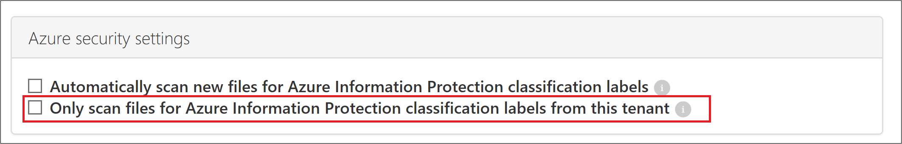
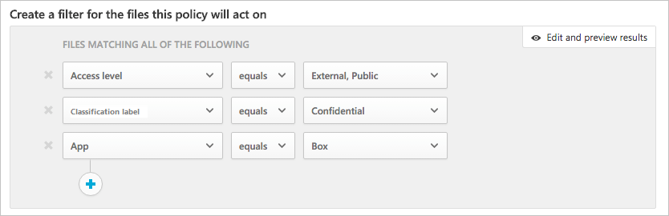

# Integración de Azure Information Protection

Cloud App Security le permite aplicar etiquetas de clasificación de Azure Information Protection de forma automática, con o sin protección, a los archivos como una acción de gobierno de directiva de archivo. También puede investigar archivos al filtrar la etiqueta de clasificación aplicada en el portal de Cloud App Security. Esto permite mayor visibilidad y control de la información confidencial en la nube. La integración de Azure Information Protection con Cloud App Security es tan fácil como seleccionar una sola casilla. 

Al integrar Azure Information Protection en Cloud App Security, puede aprovechar todas las funciones de ambos servicios y proteger los archivos en la nube, entre lo que se incluye lo siguiente:
- La capacidad de aplicar etiquetas de clasificación como una acción de gobierno a archivos que coincidan con las directivas.
- La capacidad de ver todos los archivos clasificados en una ubicación central.
- La capacidad de realizar la investigación en función del nivel de clasificación y cuantificar la exposición de la información confidencial en las aplicaciones en la nube.
- La capacidad de crear directivas para asegurarse de que los archivos clasificados se controlan correctamente.

> [!NOTE] 
> Para habilitar esta característica, necesita una licencia de Cloud App Security y una licencia para Azure Information Protection Premium P2. Tan pronto como se activen las licencias, Cloud App Security sincroniza las etiquetas de las organizaciones del servicio Azure Information Protection.

## Requisitos previos

Actualmente, Cloud App Security permite aplicar etiquetas de clasificación de Azure Information Protection a los siguientes tipos de archivo:

- Word: docm, docx, dotm, dotx
- Excel: xlam, xlsm, xlsx, xltx
- PowerPoint: potm, potx, ppsx, ppsm, pptm, pptx
- Los archivos PDF y de imagen estarán disponibles en versiones futuras. 

Esta característica está disponible actualmente para los archivos que se almacenan en Box, SharePoint Online y OneDrive para la Empresa. Se admitirán más aplicaciones en la nube en futuras versiones.

Actualmente, Cloud App Security no puede examinar ni cambiar archivos etiquetados con protección fuera de Cloud App Security. Se pueden examinar archivos etiquetados (sin protección) de forma externa a Cloud App Security y Cloud App Security puede aplicar otra etiqueta (con o sin protección), tal y como se define en las directivas de Cloud App Security.

## Cómo funciona
Probablemente esté familiarizado con las etiquetas de clasificación de archivos de [Azure Information Protection](https://docs.microsoft.com/information-protection/). Puede ver las etiquetas de clasificación de Azure Information Protection en Cloud App Security. Al integrar Cloud App Security con Azure Information Protection, Cloud App Security examina los archivos del modo siguiente:
1. Cloud App Security recupera la lista de todas las etiquetas de clasificación que se hayan usado en su inquilino. Esta acción se realiza cada hora para mantener la lista actualizada.
2. Después, Cloud App Security examina los archivos en busca de etiquetas de clasificación de la manera siguiente: a. Si ha habilitado el examen automático (vea lo que hay a continuación), todos los archivos nuevos o modificados se agregan a la cola de examen y, después, todos los archivos y repositorios existentes se examinan, clasifican y protegen.
    b. Si ha establecido una directiva de archivo (consulte la información a continuación) para buscar etiquetas de clasificación, estos archivos se agregan a la cola de examen de etiquetas de clasificación.
3. Como se mencionó anteriormente, estos exámenes son para las etiquetas de clasificación detectadas en el examen inicial que Cloud App Security lleva a cabo para ver qué etiquetas de clasificación se usan en el inquilino. Las etiquetas externas, es decir, las etiquetas de clasificación establecidas por una persona externa al inquilino, se agregan a la lista de etiquetas de clasificación. Si no quiere que se examinen, seleccione la casilla **Buscar únicamente las etiquetas de clasificación de Azure Information Protection de este inquilino en los archivos** (consulte la información a continuación).
4. Después de habilitar Azure Information Protection en Cloud App Security, también se examinarán en busca de etiquetas de clasificación todos los archivos nuevos que se agreguen a Office 365.
5. Puede crear directivas de seguridad de Cloud App Security que apliquen sus etiquetas de clasificación de forma automática.

## Cómo integrar Azure Information Protection con Cloud App Security
  
### Habilitar Azure Information Protection

Lo único que debe hacer para integrar Azure Information Protection con Cloud App Security es habilitar el examen automático para permitir la búsqueda de etiquetas de clasificación de Azure Information Protection en los archivos de Office 365 sin necesidad de crear una directiva. Después de habilitarlo, si tiene archivos en su entorno de nube con etiquetas de clasificación de Azure Information Protection, los verá en Cloud App Security.

Para permitir que Cloud App Security examine archivos que tengan la inspección de contenido habilitada en busca de etiquetas de clasificación:

1. En Cloud App Security, en el engranaje de configuración, seleccione la página **Configuración general**.
2. En Azure Information Protection, seleccione **Analizar automáticamente los archivos en busca de etiquetas de clasificación de Azure Information Protection**. 

Después de habilitar Azure Information Protection, podrá ver los archivos que tengan etiquetas de clasificación y filtrarlos por etiqueta en Cloud App Security. Una vez que Cloud App Security esté conectado a la aplicación en la nube, podrá usar las características de integración de Azure Information Protection de Cloud App Security que le permiten aplicar etiquetas de Azure Information Protection (con o sin protección) directamente en el portal de Cloud App Security. Para ello, puede agregarlas directamente a archivos o configurar una directiva de archivo para aplicar de forma automática las etiquetas de clasificación como una acción de gobierno.

 

> [!NOTE] 
> El examen automático no examina los archivos existentes hasta que se vuelvan a modificar. Para examinar los archivos existentes en busca de etiquetas de clasificación de Azure Information Protection, debe tener al menos una **directiva de archivos de inspección de contenido**. Si no tiene ninguna, cree una nueva **directiva de archivos**, elimine todos los filtros predeterminados, marque la opción **Inspección de contenido**. A continuación, en **Inspección de contenido**, haga clic en **Incluir archivos que coincidan con una expresión preestablecida** y seleccione un valor predefinido. Después, guarde la directiva. Esto habilita la inspección de contenido, que detecta automáticamente etiquetas de clasificación de Azure Information Protection.

#### Establecer etiquetas internas y externas
De forma predeterminada, Cloud App Security examina las etiquetas de clasificación que se han definido en su organización, así como las externas que han definido otras organizaciones. 

Para ignorar las etiquetas de clasificación establecidas por una persona externa a la organización, en el portal de Cloud App Security, vaya a **Configuración general** y, después, a **Configuración de seguridad de Azure** y seleccione **Ignorar las etiquetas de clasificación de Azure Information Protection de otros inquilinos**.
 

### Aplicar etiquetas directamente a archivos

1. En la página **Archivos**, seleccione el archivo que quiera proteger, haga clic en los tres puntos situados al final de la fila del archivo y elija **Aplicar etiqueta de clasificación**.

 
  
  >[!NOTE]
  >Azure Information Protection protege los archivos con un tamaño máximo de 50 MB. 

2. Se le pide que elija una de las etiquetas de clasificación de su organización para aplicarla al archivo; luego, haga clic en **Aplicar**. 

3. Después de elegir una etiqueta de clasificación y hacer clic en Aplicar, Cloud App Security aplicará la etiqueta de clasificación al archivo original.

5. También puede elegir la opción **Quitar etiqueta de clasificación** para quitar las etiquetas de clasificación. 

Para obtener más información sobre cómo funcionan conjuntamente Cloud App Security y Azure Information Protection, consulte [Protección de datos frente a errores de los usuarios](https://docs.microsoft.com/enterprise-mobility-security/solutions/protect-data-user-mistake).

### Etiquetar archivos automáticamente (versión preliminar)

Para aplicar de forma automática etiquetas de clasificación a los archivos, cree una directiva de archivo y configure la opción **Aplicar etiqueta de clasificación** como la acción de gobierno.

Siga estas instrucciones para crear la directiva de archivo:

1.  Cree una directiva de archivo.
2.  Establezca la directiva, incluido el tipo de archivo que quiera detectar, por ejemplo, todos los archivos donde **Nivel de acceso** no sea igual a **Interno** y donde la **UO del propietario** sea igual a su equipo financiero. 
3.  En las acciones de gobierno de la aplicación correspondiente, vaya a **Aplicar etiqueta de clasificación** y después seleccione el tipo de etiqueta.

   

### Controlar la exposición del archivo

- Si este es el documento en el que ha incluido una etiqueta de clasificación de Azure Information Protection:

   

- Puede ver este archivo en Cloud App Security en la página **Archivos**. Para ello, filtre la etiqueta de clasificación:

   

- Puede obtener más información sobre estos archivos y sus etiquetas de clasificación en el cajón de archivos; para ello, haga clic en el archivo en cuestión en la página **Archivos** y compruebe si tiene una etiqueta de clasificación:

   

- Después, puede crear directivas de archivos en Cloud App Security para controlar los archivos que se comparten de forma inapropiada y los archivos que están etiquetados y se han modificado recientemente.
- Además, puede desencadenar alertas en las actividades relacionadas con archivos clasificados.

  

- También puede crear una directiva que aplique automáticamente una etiqueta de clasificación a determinados archivos.

> [!Note]
> Cuando las etiquetas de Azure Identity Protection están deshabilitadas en un archivo, las etiquetas deshabilitadas aparecen como deshabilitadas en Cloud App Security. No se muestran las etiquetas eliminadas.

**Directiva de ejemplo: datos confidenciales que se comparten externamente en Box:**

1.  Cree una directiva de archivo.
2.  Establezca el nombre, la gravedad y la categoría de la directiva.
3.  Agregue los siguientes filtros para buscar todos los datos confidenciales que se comparten externamente en Box:

 

**Directiva de ejemplo: datos restringidos que se han modificado recientemente fuera de la carpeta Finanzas en SharePoint:**

1.  Cree una directiva de archivo.
2.  Establezca el nombre, la gravedad y la categoría de la directiva.
3.  Agregue los siguientes filtros para buscar todos los datos restringidos que se han modificado recientemente y agregue una exclusión para la carpeta Finanzas en la opción de selección de carpeta: 
 
 

También puede establecer alertas, notificaciones al usuario o emprender acciones inmediatas para estas directivas.
Obtenga más información sobre [acciones de gobierno](governance-actions.md).

Obtenga más información sobre [Azure Information Protection](https://docs.microsoft.com/en-us/information-protection/understand-explore/what-is-information-protection) y consulte su [Tutorial de inicio rápido](https://docs.microsoft.com/en-us/information-protection/get-started/infoprotect-quick-start-tutorial).

 
## Vídeos relacionados  
[Cloud App Security + Azure Information Protection Integrations](https://channel9.msdn.com/Shows/Microsoft-Security/MCAS--AIP-Integrations) (Integraciones de Cloud App Security y Azure Information Protection)  

## Consulte también  
[Controlar las aplicaciones en la nube con directivas](control-cloud-apps-with-policies.md)   

[Los clientes Premier también pueden elegir Cloud App Security directamente desde el Portal Premier.](https://premier.microsoft.com/)  
  
