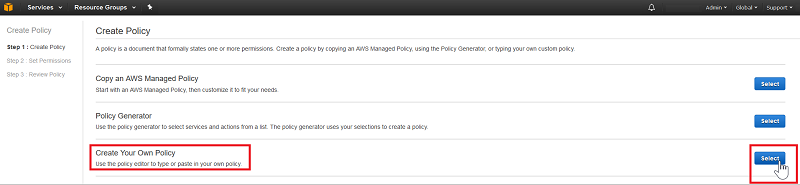
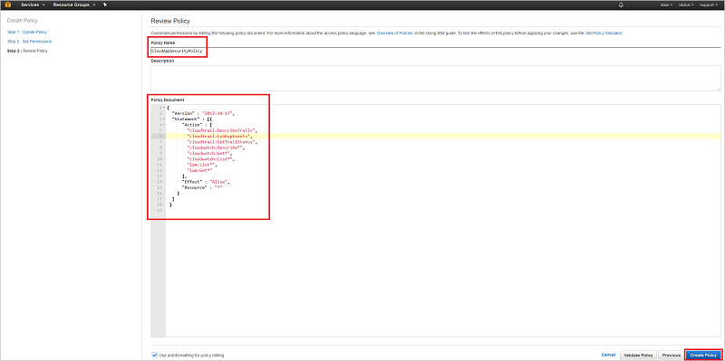

# <a name="connect-aws-to-microsoft-cloud-app-security"></a>Conectar AWS con Microsoft Cloud App Security
En esta sección se proporcionan instrucciones para conectar Cloud App Security con una cuenta de Amazon Web Services existente mediante las API del conector.  
  
## <a name="how-to-connect-amazon-web-services-to-cloud-app-security"></a>Cómo conectar Amazon Web Services con Cloud App Security  
  
1.  En la [consola de Amazon Web Services](https://console.aws.amazon.com/), en **Security, Identity & Compliance** (Seguridad, identidad y cumplimiento), haga clic en **IAM**.  
  
       
  
2.  Haga clic en la pestaña **Usuarios** y, después, en **Agregar usuario**.  
  
           
  
4.  En el paso **Detalles**, proporcione un nombre de usuario nuevo para Cloud App Security, asegúrese de que en **Tipo de acceso** selecciona **Acceso mediante programación** y haga clic en **Next Permissions** (Siguiente: permisos).  

     

5. En el paso **Permisos**, seleccione **Attach existing policies directly** (Adjuntar las directivas existentes directamente) y haga clic en **Crear directiva**.

   

6.  En **Crear directiva**, seleccione **Create Your Own Policy** (Crear su propia directiva).
 
    
 
7.  En **Revisar directiva**, proporcione un **Nombre de directiva**, por ejemplo, CloudAppSecurityPolicy.

    

8. Después, pegue lo siguiente en el campo **Policy Document** (Documento de directiva) y haga clic en **Crear directiva**:
  
    ```     
    {  
      "Version" : "2012-10-17",  
      "Statement" : [{  
          "Action" : [  
            "cloudtrail:DescribeTrails",  
            "cloudtrail:LookupEvents",  
            "cloudtrail:GetTrailStatus",  
            "cloudwatch:Describe*",  
            "cloudwatch:Get*",  
            "cloudwatch:List*",  
            "iam:List*",  
            "iam:Get*"  
          ],  
          "Effect" : "Allow",  
          "Resource" : "*"  
        }  
      ]  
     }  
  
    ```  
  
9. De nuevo en la pantalla **Agregar usuario**, actualice la lista si es necesario, seleccione el usuario que acaba de crear y haga clic en **Next Review** (Siguiente: revisión).

   

10. Si todos los detalles son correctos, haga clic en **Crear usuario**.

    

11. Cuando obtenga el mensaje de operación correcta, haga clic en **Descargar CSV** para guardar una copia de las credenciales del nuevo usuario, ya que las necesitará más adelante.  

    
  
10. En la consola AWS, haga clic en **Servicios** y, en **Herramientas de administración**, haga clic en **CloudTrail**.  
  
       
  
    Si no ha usado nunca CloudTrail, haga clic en **Iniciar** y configúrelo. Para ello, proporcione un nombre, seleccione el depósito de S3 adecuado y haga clic en **Activar**. Para asegurarse de que tiene una cobertura completa, establezca **Apply to all regions** (Aplicar a todas las regiones) en **Sí**.
  
       
  
    Verá el nuevo nombre de CloudTrail en la lista **Trails** (Seguimientos).
    
      
  
11. En el portal de Cloud App Security, haga clic en **Investigar** y, después, en **Aplicaciones conectadas**.  
  
12. En la página **Conectores de aplicaciones**, haga clic en el botón del signo más y, después, en **AWS**.  
  
       
  
13. En el elemento emergente, pegue la **clave de acceso** y la **clave secreta** del archivo CSV en los campos correspondientes y haga clic en **Conectar**.  
    
  
14. Haga clic en **Probar API** para confirmar que la conexión se ha realizado correctamente.  
  
     La prueba puede tardar unos minutos. Cuando haya finalizado, recibirá una notificación que le indicará si se ha realizado correcta o incorrectamente. Cuando reciba la notificación de que se ha realizado correctamente, haga clic en **Listo**.  
  
Después de conectar AWS, recibirá eventos de los siete días previos a la conexión, a menos que acabe de habilitar CloudTrail, en cuyo caso recibirá eventos a partir del momento en que habilitó CloudTrail.
  
## <a name="see-also"></a>Consulte también  
[Controlar las aplicaciones en la nube con directivas](control-cloud-apps-with-policies.md)   
[Para obtener soporte técnico, visite la página de soporte técnico asistido de Cloud App Security.](http://support.microsoft.com/oas/default.aspx?prid=16031)   
[Los clientes Premier también pueden elegir Cloud App Security directamente desde el Portal Premier.](https://premier.microsoft.com/)  
  
  