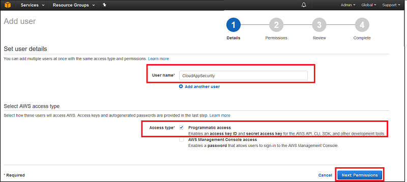
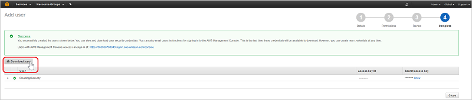
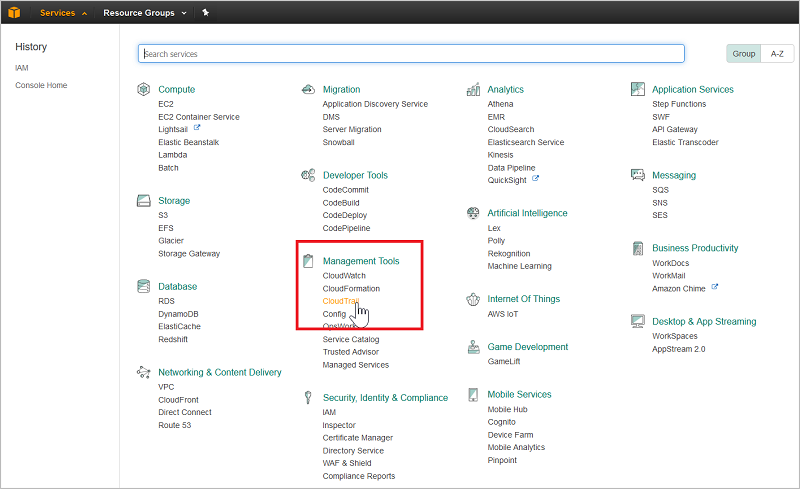
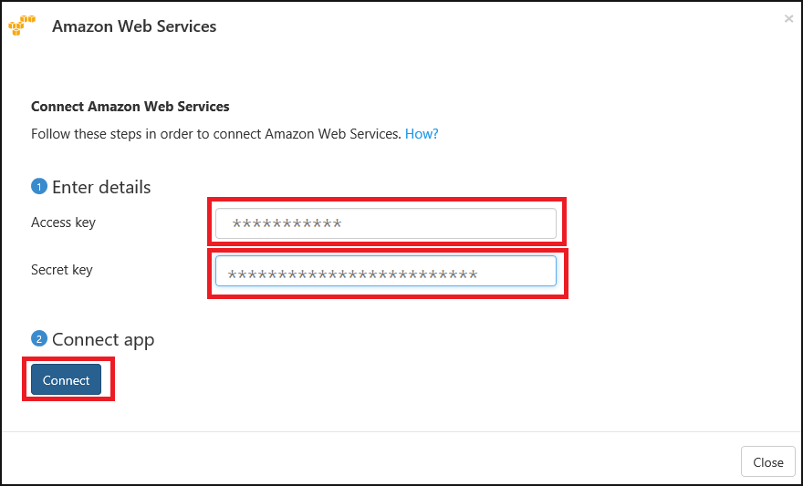

# <a name="connect-aws-to-microsoft-cloud-app-security"></a>Conectar AWS con Microsoft Cloud App Security

*Se aplica a: Microsoft Cloud App Security*

En este artículo se ofrecen instrucciones para conectar Microsoft Cloud App Security con una cuenta de Amazon Web Services existente mediante las API del conector. Esta conexión le ofrece visibilidad y control del uso de la aplicación de AWS. 
  
## <a name="how-to-connect-amazon-web-services-to-cloud-app-security"></a>Cómo conectar Amazon Web Services con Cloud App Security  
  
1.  En la [consola de Amazon Web Services](https://console.aws.amazon.com/), en **Security, Identity & Compliance** (Seguridad, identidad y cumplimiento), haga clic en **IAM**.  
  
       
  
2.  Haga clic en la pestaña **Usuarios** y, después, en **Agregar usuario**.  
  
           
  
4.  En el paso **Detalles**, proporcione un nuevo nombre de usuario para Cloud App Security. Asegúrese de que, en **Tipo de acceso**, selecciona **Acceso mediante programación** y, después, haga clic en **Next Permissions** (Permisos siguientes).  

     

5. Haga clic en la pestaña JSON:

     

6. Pegue el siguiente script en el área proporcionada:

    ```     
    {  
      "Version" : "2012-10-17",  
      "Statement" : [{  
          "Action" : [  
            "cloudtrail:DescribeTrails",  
            "cloudtrail:LookupEvents",  
            "cloudtrail:GetTrailStatus",  
            "cloudwatch:Describe*",  
            "cloudwatch:Get*",  
            "cloudwatch:List*",  
            "iam:List*",  
            "iam:Get*",
            "s3:ListAllMyBuckets",
            "s3:PutBucketAcl",
            "s3:GetBucketAcl",
            "s3:GetBucketLocation"
          ],  
          "Effect" : "Allow",  
          "Resource" : "*"  
        }  
      ]  
     }  
  
    ```  

     
    
6. Haga clic en **Revisar directiva**.

7. Proporcione un **Nombre** y haga clic en **Crear directiva**.

     

9. De nuevo en la pantalla **Agregar usuario**, actualice la lista si es necesario, seleccione el usuario que ha creado y haga clic en **Next Review** (Revisión siguiente).

   

10. Si todos los detalles son correctos, haga clic en **Crear usuario**.

    

11. Cuando obtenga el mensaje de operación correcta, haga clic en **Descargar CSV** para guardar una copia de las credenciales del nuevo usuario, ya que las necesitará más adelante.  

    
  
10. En la consola AWS, haga clic en **Servicios** y, en **Herramientas de administración**, haga clic en **CloudTrail**.  
  
       
  
    Si no ha usado nunca CloudTrail, haga clic en **Iniciar** y configúrelo. Para ello, proporcione un nombre, seleccione el depósito de S3 adecuado y haga clic en **Activar**. Para asegurarse de que tiene una cobertura completa, establezca **Apply to all regions** (Aplicar a todas las regiones) en **Sí**.
  
       
  
    Verá el nuevo nombre de CloudTrail en la lista **Trails** (Seguimientos).
    
      
  
11. En el portal de Cloud App Security, haga clic en **Investigar** y, después, en **Aplicaciones conectadas**.  
  
12. En la página **Conectores de aplicaciones**, haga clic en el botón del signo más seguido de **Amazon Web Services**.  
  
       
  
13. En el elemento emergente, pegue la **clave de acceso** y la **clave secreta** del archivo CSV en los campos correspondientes y haga clic en **Conectar**.  
    
  
14. Haga clic en **Probar API** para confirmar que la conexión se ha realizado correctamente.  
  
     La prueba puede tardar unos minutos. Cuando haya finalizado, recibirá una notificación que le indicará si se ha realizado correcta o incorrectamente. Cuando reciba la notificación de que se ha realizado correctamente, haga clic en **Listo**.  
  
Después de conectarse a AWS, recibirá eventos de siete días anteriores a la conexión. Si solo ha habilitado CloudTrail, en cuyo caso recibirá los eventos desde el momento en que habilitó CloudTrail.
  
## <a name="next-steps"></a>Pasos siguientes  
[Controlar las aplicaciones en la nube con directivas](control-cloud-apps-with-policies.md)   

[Los clientes Premier también pueden crear una solicitud de soporte técnico directamente en el portal Premier.](https://premier.microsoft.com/)  
  
  