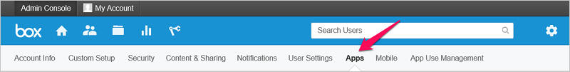

# Conectar Box con Microsoft Cloud App Security
En esta sección se proporcionan instrucciones para conectar Cloud App Security con una cuenta de Box existente mediante las API del conector de aplicaciones.  
  
## Cómo conectar Box con Cloud App Security  
  
> [!NOTE]  
>  Si se implementa con una cuenta que no es una cuenta de administrador, se produce un error en la prueba de la API y no se permite a Cloud App Security analizar todos los archivos de Box. Si esto supone un problema, puede implementar con un coadministrador con todos los privilegios verificados, aunque la prueba de la API seguirá generando un error y no se analizarán los archivos que pertenezcan a otros administradores en Box.  
  
1.  Si restringe el acceso de permisos de la aplicación, siga estos pasos. De lo contrario, vaya al paso 2.  
  
    -   En la consola de administrador de Box, haga clic en el icono de configuración y luego en **Configuración empresarial**.  
  
           
  
    -   Haga clic en la pestaña **Aplicaciones**.  
  
           
  
    -   Si ha seleccionado **Aplicaciones no publicadas**, en el cuadro de texto **Excepto**, agregue el número de serie de la aplicación Cloud App Security:  Centro de datos de Estados Unidos 1: `nduj1o3yavu30dii7e03c3n7p49cj2qh`   Centro de datos de la Unión Europea 1: `me9cm6n7kr4mfz135yt0ab9f5k4ze8qp`  Después, haga clic en **Guardar**. Para obtener información sobre cómo consultar con qué centros de datos de Cloud App Security tiene conexión, consulte [Tokens de API](api-tokens.md). 
  
           
  
    > [!NOTE]  
    >  Si es cliente de Adallom y la dirección URL de la consola es de Adallom y no de Cloud App Security, use este número de serie de la aplicación: bwahmilhdlpbqy2ongkl119o3lrkoshc.  
  
2.  En el portal de Cloud App Security, haga clic en **Investigar** y, después, en **Aplicaciones conectadas**.  
  
3.  En la página **Conectores de aplicaciones**, haga clic en el botón del signo más y seleccione **Box**.  
  
       
  
4.  En el elemento emergente **Box settings** (Configuración de Box), haga clic en **Follow this link** (Seguir este vínculo).  
  
5.  Se abre la página de inicio de sesión de Box. Escriba sus credenciales para permitir que Cloud App Security tenga acceso a la aplicación de Box de su equipo.  
  
6.  Box le pregunta si quiere permitir que Cloud App Security acceda a la información y el registro de actividad de su equipo y que realice actividades como cualquier miembro del equipo. Para continuar, haga clic en **Permitir**.  
  
7.  De vuelta en el portal de Cloud App Security, debería recibir un mensaje que indica que Box se ha conectado correctamente.  
  
8.  Haga clic en **Probar API** para confirmar que la conexión se ha realizado correctamente.  
  
     La prueba puede tardar unos minutos. Cuando reciba la notificación de que se ha realizado correctamente, haga clic en **Cerrar**.  
  
Box ya está conectado a Cloud App Security.  
 
Después de conectar Box, recibirá eventos de 60 días anteriores a la conexión.
  
Después de conectar Box, Cloud App Security realiza un examen completo. En función del número de archivos y los usuarios que tenga, el examen podría tardar en completarse. Para habilitar el análisis casi en tiempo real, los archivos en los que se detectan actividades se mueven al principio de la cola de análisis. Por ejemplo, un archivo editado, actualizado o compartido se analiza inmediatamente, en lugar de esperar al proceso de análisis normal. El análisis casi en tiempo real no se aplica a los archivos que no se modifican de forma inherente. Por ejemplo, los archivos que se visualizan, previsualizan, imprimen o exportan se analizan como parte del análisis programado habitual.
  
## Consulte también  
[Controlar las aplicaciones en la nube con directivas](control-cloud-apps-with-policies.md)   

[Los clientes Premier también pueden elegir Cloud App Security directamente desde el Portal Premier.](https://premier.microsoft.com/)  
  
  