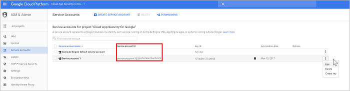

# Conectar G Suite con Microsoft Cloud App Security
En esta sección se proporcionan instrucciones para conectar Cloud App Security con una cuenta de G Suite existente mediante las API del conector.

  
  
## Configurar G Suite  
  
1.  Inicie sesión en [https://cloud.google.com/console/project](https://cloud.google.com/console/project) como superadministrador de G Suite.  
  
2.  Haga clic en **Crear un proyecto** para iniciar un nuevo proyecto.  
  
       
  
3.  En la pantalla **Nuevo proyecto**, asigne al proyecto el nombre siguiente: 
    **Microsoft Cloud App Security** y haga clic en **Crear**.  
             
  
4.  Una vez creado el proyecto, en la barra de herramientas, junto a Google Cloud Platform, seleccione el proyecto y, en **API**, haga clic en **Go to APIs overview** (Ir a la información general de las API).  
  
       
  
5.  En **API**, deshabilite todas las API enumeradas.  
      
6.  Haga clic en **Biblioteca** y habilite las siguientes API (use la línea de búsqueda si la API no figura en la lista **Popular APIs** (API populares)):  
  
       
  
    > [!NOTE]  
    >  Omita por ahora la advertencia sobre **credenciales**.  
  
    -   Admin SDK  
  
    -   Audit API  
  
    -   API de Google Drive  
  
    -   Google Apps Marketplace SDK  
  
    -   Gmail API  
            
7.  Debe tener cinco **APIs habilitadas**:  
  
       
  
8.  Haga clic en **Credenciales** y, luego, en la **pantalla de autorización de OAuth**.  
  
    -   En **Product name shown to users** (Nombre de producto mostrado a los usuarios), escriba **Microsoft Cloud App Security**.  
  
    -   El resto de campos es opcional.  
  
    -   Haga clic en **Guardar**.  
  
       
  
9. En la pantalla **API Credentials** (Credenciales de API), haga clic en la flecha situada junto a **Crear credenciales**.  
  
       

10. Seleccione **Service account key** (Clave de la cuenta del servicio).

       
  
11. En **Crear clave de cuenta de servicio**, elija **Nueva cuenta de servicio** y escriba cualquier nombre (por ejemplo, **Cuenta de servicio 1**). En **Función**, elija **Project** (Proyecto) y después **Editor**. En **Tipo de clave**, elija **P12** y haga clic en **Crear**. Active la casilla **Enable G Suite Domain-wide Delegation** (Habilitar delegación de todo el dominio de G Suite) y haga clic en **Guardar**.  
  
       
  
12.  Se guardará un archivo de certificado P12 en el equipo.  
        
12. En la pantalla **Credenciales**, haga clic en **Manage service accounts** (Administrar las cuentas de servicio) en el extremo derecho.  
         
  
13. Haga clic en los tres puntos a la derecha de la cuenta de servicio que ha creado y seleccione **Editar**.  
  
       
  
15. Copie el **identificador de la cuenta de servicio** asignado a su servicio, ya que lo necesitará más adelante.  
  
       
  
16. Abra el menú de Google; para ello, haga clic en las tres líneas horizontales junto a Google Cloud Platform en la barra de título. Seleccione el **administrador de API** seguido del **panel**.  
    
17. Desplácese a la lista de API habilitadas y haga clic en el engranaje de configuración situado junto a **API de Google Drive**.   
         

18. Proporcione la siguiente información:

    -   **Nombre de la aplicación**: Microsoft Cloud App Security.  
  
    -   **Descripción breve y Descripción larga** (opcional): Microsoft Cloud App Security proporciona visibilidad de las aplicaciones en la nube, lo que sirve para controlar, investigar y gobernar el uso de esas aplicaciones en la nube, para proteger los datos corporativos y para detectar actividades sospechosas en cualquier aplicación en la nube.  
  
    -   Google requiere que se cargue al menos un icono de aplicación. Vaya a [https://portal.cloudappsecurity.com/cas/static/files/MSLogos.zip](https://portal.cloudappsecurity.com/cas/static/files/MSLogos.zip) para descargar un archivo ZIP que contiene los iconos de Cloud App Security. Después, en **Icono de la aplicación**, arrastre y coloque las imágenes de 128x128 y 32x32.  
  
    -   En **Drive Integration** (Integración de unidades), escriba la siguiente dirección URL en **Abrir dirección URL:**  
  
         https://portal.cloudappsecurity.com/#/services/11770?tab=files  
     
           
  
19. En la lista **Enabled APIs** (API habilitadas), haga clic en el engranaje de configuración situado junto a **Google Apps Marketplace SDK**. 
           

       >[!NOTE]
       > Si el engranaje aparece deshabilitado, puede hacer clic en **Google Apps Marketplace SDK** en su lugar. 
20. Seleccione la pestaña **Configuración**. 
  
    -   Copie el **Número de proyecto (id. de aplicación)** que aparece en la parte superior para usarlo más adelante.  
  
    -   En **Nombre de la aplicación**, debe aparecer **Microsoft Cloud App Security**.
  
         Rellene el campo **Descripción de la aplicación** con "Microsoft Cloud App Security proporciona visibilidad de las aplicaciones en la nube, lo que sirve para controlar, investigar y gobernar el uso de esas aplicaciones en la nube; para proteger los datos corporativos, y para detectar actividades sospechosas en cualquier aplicación en la nube".  
  
    -   Desactive la casilla **Enable individual install** (Habilitar la instalación individual).  
  
    -   Configure las cuatro imágenes necesarias en **Iconos de la aplicación**.  
  
         Encontrará las imágenes en: [https://portal.cloudappsecurity.com/cas/static/files/MSLogos.zip](https://portal.cloudappsecurity.com/cas/static/files/MSLogos.zip)  
  
           
  
    -   Rellene lo siguiente en **Admitir URLs**:  
  
        -   **URL de las condiciones del servicio**: http://go.microsoft.com/fwlink/?LinkID=733268  
  
        -   **URL de la política de privacidad**: http://go.microsoft.com/fwlink/?LinkId=512132  
  
    -   En **OAuth 2.0 scopes** (Ámbitos de OAuth 2.0), copie y pegue las siguientes direcciones URL (cópielas una a una y presione ENTRAR después de cada una):  
  
           https://www.googleapis.com/auth/admin.reports.audit.readonly  
  
           https://www.googleapis.com/auth/admin.reports.usage.readonly  
  
           https://www.googleapis.com/auth/drive  
  
           https://www.googleapis.com/auth/drive.appdata  
  
           https://www.googleapis.com/auth/drive.apps.readonly  
  
           https://www.googleapis.com/auth/drive.file  
  
           https://www.googleapis.com/auth/drive.metadata.readonly  
  
           https://www.googleapis.com/auth/drive.readonly  
  
           https://www.googleapis.com/auth/drive.scripts  
  
           https://www.googleapis.com/auth/admin.directory.user.readonly  
  
           https://www.googleapis.com/auth/admin.directory.user.security  
  
           https://www.googleapis.com/auth/admin.directory.user.alias  
  
           https://www.googleapis.com/auth/admin.directory.orgunit  
  
           https://www.googleapis.com/auth/admin.directory.notifications  
  
           https://www.googleapis.com/auth/admin.directory.group.member  
  
           https://www.googleapis.com/auth/admin.directory.group  
  
           https://www.googleapis.com/auth/admin.directory.device.mobile.action  
  
           https://www.googleapis.com/auth/admin.directory.device.mobile  
  
           https://www.googleapis.com/auth/admin.directory.user  
  
    -   Haga clic en **Guardar cambios**.  
  
18. Vaya a [admin.google.com](https://admin.google.com/) y haga clic en **Seguridad**. 
         
 
19. Seleccione **Referencia de API**.  
         
      
20. Seleccione **Habilitar acceso de API** y haga clic en **Guardar cambios**.  
  
      

  
## Configurar Cloud App Security  
  
1.  En el portal de Cloud App Security, haga clic en **Investigar** y, después, en **Aplicaciones conectadas**.  
  
2.  En la página **Aplicaciones conectadas**, haga clic en el signo más y seleccione **G Suite**.  
       
  
3.  En el elemento emergente, proporcione la información siguiente:  
  
       
  
    1.  **Dirección de correo electrónico de la cuenta del servicio** que ha copiado en el paso 16.  
  
    2.  **Número de proyecto (identificador de la aplicación)** que ha copiado en el paso 21.  
  
    3.  Cargue el archivo P12 de **certificado** que ha guardado en el paso 12. Para hacerlo, necesita la contraseña que ha guardado.  
  
    4.  Escriba un **correo electrónico de la cuenta de administrador** de su administrador de G Suite.  
  
    5.  Active esta casilla si tiene una cuenta de G Suite ilimitada. Para obtener información sobre qué características están disponibles en Cloud App Security para G Suite Unlimited, vea [Enable instant visibility, protection and governance actions for your apps](enable-instant-visibility-protection-and-governance-actions-for-your-apps.md) (Habilitar la visibilidad, la protección y las acciones de gobierno instantáneas para las aplicaciones).  
  
    6.  Haga clic en **Guardar configuración**.  
  
    7.  **Siga el vínculo** para conectarse a G Suite. Esto abrirá G Suite. Se le pedirá autorización de acceso para Cloud App Security.  
         
    8.  Haga clic en **Probar ahora** para confirmar que la conexión se ha realizado correctamente.  
  
         La prueba puede tardar unos minutos.  
  
         Después de recibir una notificación de que todo se ha realizado correctamente, haga clic en **Listo** y cierre la página de G Suite.  
  
  
Después de conectar G Suite, recibirá eventos de 60 días anteriores a la conexión.
  
Después de conectar G Suite, Cloud App Security realiza un examen completo. En función del número de archivos y los usuarios que tenga, el examen podría tardar en completarse. Para habilitar el análisis casi en tiempo real, los archivos en los que se detecta actividad se mueven al principio de la cola de análisis. Por ejemplo, una archivo editado, actualizado o compartido se analiza inmediatamente. Esto no se aplica a los archivos que no se modifican de forma inherente. Por ejemplo, los archivos que se visualizan, previsualizan, imprimen o exportan se analizan durante un análisis normal.
  
  
## Consulte también  
[Controlar las aplicaciones en la nube con directivas](control-cloud-apps-with-policies.md)   
[Para obtener soporte técnico, visite la página de soporte técnico asistido de Cloud App Security.](http://support.microsoft.com/oas/default.aspx?prid=16031)   
[Los clientes Premier también pueden elegir Cloud App Security directamente desde el Portal Premier.](https://premier.microsoft.com/)  
  
  