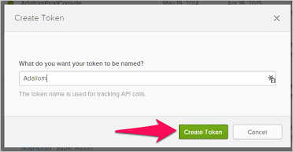

# Conectar Okta con Microsoft Cloud App Security

*Se aplica a: Microsoft Cloud App Security*

En este artículo se ofrecen instrucciones para conectar Microsoft Cloud App Security con una cuenta de Okta existente mediante las API del conector. Esta conexión le ofrece visibilidad y control del uso de Okta.

## Cómo conectar Okta con Cloud App Security

1. Se recomienda crear una cuenta de servicio de administrador en Okta para Cloud App Security.

    Asegúrese de usar una cuenta con permisos de superadministrador.

    Asegúrese de que la cuenta de Okta esté verificada.

1. En la consola de Okta, haga clic en **Administración**.

    - Haga clic en **Seguridad** y luego en **API**.

         

    - Haga clic en **Crear token**.

         

    - En el menú emergente **Crear token**, asigne un nombre al token de Cloud App Security y haga clic en **Crear token**.

         

    - En el elemento emergente **Token created successfully** (Token creado correctamente), copie el **Token value** (Valor de token).

         

1. En la consola de Cloud App Security, haga clic en **Investigar** y, después, en **Aplicaciones conectadas**.

1. En la página **Conectores de aplicaciones**, haga clic en el botón del signo más y, después, en **Okta**.

    

1. En el elemento emergente que se muestra, en el campo **Dominio**, escriba el dominio de Okta y pegue el token en el campo **Token**.

1. Haga clic en **Conectar** para crear el token de Okta en Cloud App Security.

1. Haga clic en **Probar API** para asegurarse de que la conexión se ha realizado correctamente.

    La prueba puede tardar unos minutos. Cuando reciba la notificación de que se ha realizado correctamente, haga clic en **Cerrar**.

Después de conectar Okta, recibirá eventos de 60 días anteriores a la conexión.

## Pasos siguientes

[Controlar las aplicaciones en la nube con directivas](control-cloud-apps-with-policies.md)

[!INCLUDE [Open support ticket](includes/support.md)]
