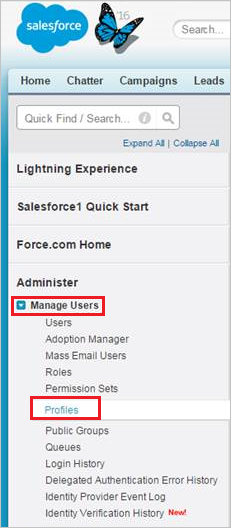

# Conectar Salesforce con Microsoft Cloud App Security

[!INCLUDE [Banner for top of topics](includes/banner.md)]

En este artículo se ofrecen instrucciones para conectar Microsoft Cloud App Security con una cuenta de Salesforce existente mediante la API del conector de aplicaciones. Esta conexión le ofrece visibilidad y control del uso de Salesforce. Para obtener información sobre cómo Cloud App Security protege Salesforce, consulte [protección de Salesforce](protect-salesforce.md).

## Cómo conectar Salesforce con Cloud App Security

1. Se recomienda tener una cuenta de administrador de servicio dedicada para Cloud App Security.

1. Confirme que la API de REST está habilitada en Salesforce.

    La cuenta de Salesforce debe ser una de las siguientes ediciones que incluyen compatibilidad con la API de REST:

    **Performance**, **Enterprise**, **Unlimited** o **Developer**.

    La edición **Professional** no tiene la API REST de forma predeterminada, pero se puede agregar a petición.

    Compruebe que la edición tiene disponible la API de REST y que está habilitada de la manera siguiente:

    * Inicie sesión en su cuenta de Salesforce y vaya a la página **Configuración**.

    * En **Administrar usuarios**, vaya a la página **Perfiles de usuario**.

        

    * Haga clic en **Nuevo** para crear un perfil nuevo.
    * Elija el perfil que acaba de crear para implementar Cloud App Security y haga clic en **Editar**. Este perfil se utilizará para la cuenta de servicio de Cloud App Security para configurar el conector de aplicaciones.

         

    * Asegúrese de que las siguientes casillas están activadas:
      * **API Enabled** (API habilitada)
      * **Ver todos los datos**
      * **Manage Salesforce CRM Content** (Administrar contenido CRM de Salesforce)
      * **Administración de usuarios**
      * **[Consultar todos los archivos](https://go.microsoft.com/fwlink/?linkid=2106480)**

      Si estas casillas no están activadas, es posible que deba ponerse en contacto con Salesforce para agregarlas a su cuenta.

1. Si su organización tiene habilitada la opción **Salesforce CRM Content** (Contenido CRM de Salesforce), asegúrese de que la cuenta administrativa actual también la tenga habilitada.

    1. Vaya a la página de configuración de Salesforce.

        

    1. En el menú lateral, seleccione **Administrar usuarios** y haga clic en **Usuarios**.

        

    1. Seleccione el usuario administrativo actual de su usuario de Cloud App Security dedicado.

    1. Asegúrese de que está seleccionada la casilla **Salesforce CRM Content User** (Usuario de contenido CRM de Salesforce).

        Si no está activada, haga clic en **Editar** y después active la casilla.

        

    1. En **configuración de sesión**, asegúrese de que la casilla de verificación seleccionar **las sesiones de bloqueo en la dirección IP desde la que se originaron** **no** está activada.

        

    1. Haga clic en **Save**(Guardar).

1. En la consola de Cloud App Security, haga clic en **Investigar** y, después, en **Aplicaciones conectadas**.

1. En la página **Conectores de aplicaciones**, haga clic en el botón del signo más y, después, en **Salesforce**.

    

1. En la página de configuración de Salesforce, en la pestaña API, haga clic en **Seguir vínculo**, en función de la instancia que vaya a instalar.

1. Se abrirá la página de inicio de sesión de Salesforce. Escriba sus credenciales para permitir que Cloud App Security tenga acceso a la aplicación de Salesforce de su equipo.

    

1. Salesforce le preguntará si quiere permitir que Cloud App Security acceda a la información y el registro de actividad de su equipo y que realice actividades como cualquier miembro del equipo. Para continuar, haga clic en **Permitir**.

1. En este momento recibirá una notificación que le indicará si la implementación se ha llevado a cabo correcta o incorrectamente. Cloud App Security ya está autorizado en Salesforce.com.

1. Si vuelve a la consola de Cloud App Security, debería aparecer un mensaje que le indica que Salesforce se ha conectado correctamente.

1. Haga clic en **Probar API** para confirmar que la conexión se ha realizado correctamente.

    La prueba puede tardar unos minutos. Cuando reciba la notificación de que se ha realizado correctamente, haga clic en **Listo**.

Después de conectarse a Salesforce, recibirá eventos de este modo: desencadenadores en el momento de la conexión, eventos de inicio de sesión y traza de auditoría de configuración de los 60 días anteriores a la conexión, y supervisión de eventos de los 30 días anteriores o del día anterior, en función de su licencia de supervisión de eventos de Salesforce. La API de Cloud App Security se comunica directamente con las API disponibles de Salesforce. Dado que Salesforce limita el número de llamadas API que puede recibir, Cloud App Security lo tiene en cuenta y respeta la limitación. Las API de Salesforce envían cada respuesta con un campo para los contadores de API, incluido el total disponible y restante. Cloud App Security lo calcula como un porcentaje y siempre se asegura de que quede como restante un 10 % de las llamadas de API disponibles.

> [!NOTE]
> La limitación de Cloud App Security se calcula únicamente según sus propias llamadas API con Salesforce, no según las de otras aplicaciones que realizan llamadas API con Salesforce.
> La restricción de las llamadas API debido a la limitación puede reducir la velocidad a la que se ingieren los datos en Cloud App Security, pero normalmente se pone al día por la noche.

Cloud App Security procesa los eventos de Salesforce de la manera siguiente:

* Eventos de inicio de sesión cada 15 minutos
* Configuración de registros de auditoría cada 15 minutos
* Registros de eventos cada 1 hora. Para más información sobre los eventos de Salesforce, consulte el artículo sobre el [uso de supervisión de eventos](https://developer.salesforce.com/docs/atlas.en-us.api_rest.meta/api_rest/using_resources_event_log_files.htm).

Si tiene problemas para conectar la aplicación, consulte [solución de problemas de conectores de aplicaciones](troubleshooting-api-connectors-using-error-messages.md).

## Pasos siguientes

> [!div class="nextstepaction"]
> [Controlar las aplicaciones en la nube con directivas](control-cloud-apps-with-policies.md)

[!INCLUDE [Open support ticket](includes/support.md)]
