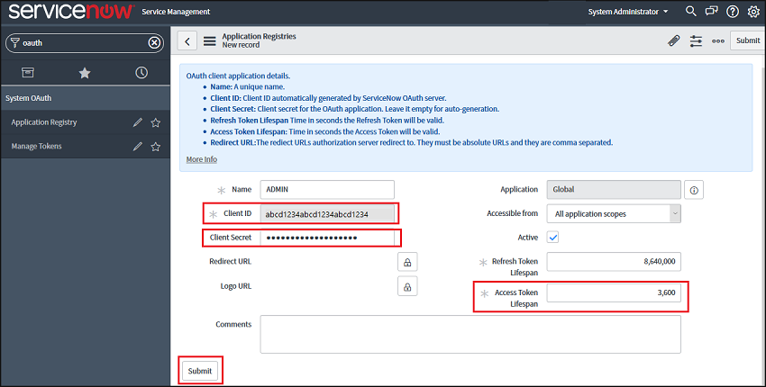
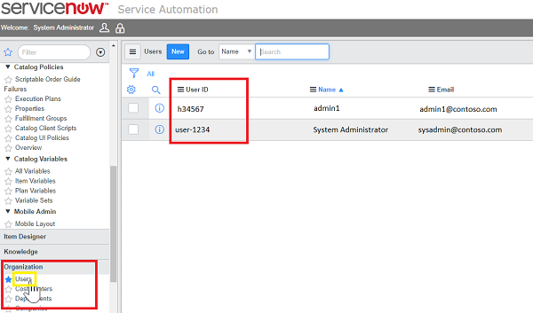

# Conectar ServiceNow con Microsoft Cloud App Security

*Se aplica a: Microsoft Cloud App Security*

En este artículo se ofrecen instrucciones para conectar Microsoft Cloud App Security con una cuenta de ServiceNow existente mediante la API del conector de aplicaciones. Esta conexión le ofrece visibilidad y control del uso de ServiceNow. Para obtener información sobre cómo Cloud App Security protege ServiceNow, consulte [protección](protect-servicenow.md)de servicenow.

> [!NOTE]
> Se recomienda implementar ServiceNow mediante tokens de aplicación OAuth, que están disponibles para Fuji y versiones posteriores. Consulte la [documentación de ServiceNow](https://wiki.servicenow.com/index.php?title=OAuth_Applications#gsc.tab=0) correspondiente.
> En el caso de versiones anteriores, está disponible un [modo de conexiones heredadas](#legacy-servicenow-connection) según el usuario y la contraseña. El nombre de usuario y la contraseña proporcionados solo se usan para la generación de tokens de API y no se guardan después del proceso de conexión inicial.

> [!NOTE]
> Cloud App Security admite las siguientes versiones de ServiceNow: Eureka, Fiji, Geneva, Helsinki, Estambul, Yakarta, Kingston, Londres, Madrid y Nueva York. Para conectar ServiceNow con Cloud App Security, debe tener el rol de **administrador** y asegurarse de que la instancia de ServiceNow admite el acceso a la API. Para más información, vea la [documentación del producto de ServiceNow](https://wiki.servicenow.com/index.php?title=Base_System_Roles#gsc.tab=0).

## Cómo conectar ServiceNow con Cloud App Security mediante OAuth

1. Inicie sesión con una cuenta de administrador en la cuenta de ServiceNow.

    > [!NOTE]
    > El nombre de usuario y la contraseña proporcionados solo se usan para la generación de tokens de API y no se guardan después del proceso de conexión inicial.

2. En la barra de búsqueda del **navegador de filtros**, escriba **OAuth** y seleccione **Registro de aplicación**.

3. En la barra de menús **Registros de aplicación**, haga clic en **Nuevo** para crear un perfil de OAuth.

    

4. En **¿Qué tipo de aplicación de OAuth?**, haga clic en **Crear un punto de conexión de la API de OAuth para clientes externos**.

    

5. En **Nuevo registro de registros de aplicación**, rellene los campos siguientes:

    - En el campo **Nombre** escriba el nombre del nuevo perfil de OAuth, por ejemplo, CloudAppSecurity.

    - El **identificador de cliente** se generará automáticamente. Copie este identificador, ya que deberá pegarlo en Cloud App Security para completar la conexión.

    - En el campo **Secreto de cliente**, escriba una cadena. Si lo deja vacío, se generará automáticamente un secreto aleatorio. Cópielo y guárdelo para más adelante.

    - Aumente **Duración del token de acceso** como mínimo a 3600.

    - Haga clic en **Enviar**.

    

6. En el portal de Cloud App Security, haga clic en **Investigar** y, después, en **Aplicaciones conectadas**.

7. En la página **Conectores de aplicaciones**, haga clic en el botón del signo más y, después, en **ServiceNow**.

    

8. En el elemento emergente, agregue el ID. de usuario de ServiceNow, la contraseña, la dirección URL de la instancia, el identificador de cliente y el secreto de cliente en los cuadros correspondientes. Para encontrar el identificador de usuario de ServiceNow, en el portal de ServiceNow, vaya a **Usuarios** y busque su nombre en la tabla.

    

9. Haga clic en **Conectar**.

    

10. Haga clic en **Probar ahora** para confirmar que la conexión se ha realizado correctamente.

    La prueba puede tardar unos minutos. Cuando reciba la notificación de que se ha realizado correctamente, haga clic en **Cerrar**.

Después de conectar ServiceNow, recibirá eventos durante 7 días antes de la conexión.

## Conexión de ServiceNow heredada

Para conectar ServiceNow con Cloud App Security, debe tener permisos de administrador y asegurarse de que la instancia de ServiceNow admite el acceso a la API.

1. Inicie sesión con una cuenta de administrador en la cuenta de ServiceNow.

2. Cree una nueva cuenta de servicio para Cloud App Security y asocie el rol de administrador a la cuenta recién creada.

3. Asegúrese de que el complemento de la API de REST está activado.

    

4. En el portal de Cloud App Security, haga clic en **Investigar** y, después, en **Aplicaciones autorizadas**.

5. En la fila de ServiceNow, haga clic en **Conectar** en la columna **Estado del conector de aplicaciones** o haga clic en el botón **Conectar una aplicación** y luego en **ServiceNow**.

   

6. En la página de configuración de ServiceNow, en la pestaña API, agregue el identificador de usuario, la contraseña y la dirección URL de la instancia de ServiceNow en los cuadros correspondientes.

7. Haga clic en **Conectar**.

    

8. Haga clic en **Probar API** para confirmar que la conexión se ha realizado correctamente.

    La prueba puede tardar unos minutos. Cuando reciba la notificación de que se ha realizado correctamente, haga clic en **Cerrar**.

Después de conectar ServiceNow, recibirá eventos de 7 días antes de la conexión.

Si tiene problemas para conectar la aplicación, consulte [solución de problemas de conectores de aplicaciones](troubleshooting-api-connectors-using-error-messages.md).

## Pasos siguientes

> [!div class="nextstepaction"]
> [Controlar las aplicaciones en la nube con directivas](control-cloud-apps-with-policies.md)

[!INCLUDE [Open support ticket](includes/support.md)]
