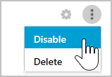

# Control de aplicaciones en la nube con directivas

[!INCLUDE [Banner for top of topics](includes/banner.md)]

Las directivas permiten definir la forma en que quiere que los usuarios se comporten en la nube. Con ellas se puede detectar comportamientos arriesgados, infracciones o actividades y puntos de datos sospechosos en su entorno de la nube. Si es necesario, puede integrar flujos de trabajo de corrección para lograr una mitigación de riesgos completa. Hay varios tipos de directivas que se correlacionan con los diferentes tipos de información que quiere recopilar sobre el entorno de nube y los tipos de acciones correctoras que quizás quiera realizar.

Por ejemplo, si hay una amenaza de infracción de datos que quiere poner en cuarentena, necesitará un tipo de directiva distinto que si quiere bloquear el uso de una aplicación de riesgo en la nube en la organización.

## Tipos de directiva

Cuando consulta la página **Directiva**, se pueden distinguir las distintas políticas y plantillas por tipo e icono para ver las directivas que estarán disponibles. Las directivas disponibles dependen del origen de datos y lo que ha habilitado en Cloud App Security para su organización. Por ejemplo, si se cargan registros de Cloud Discovery, se muestran las directivas relativas a Cloud Discovery.

Pueden crearse los siguientes tipos de directivas:

|Icono de tipo de directiva|Tipo de directiva|Uso|
|-----|-----------------|---------|
||Directiva de acceso|Las directivas de acceso proporcionan funcionalidades de supervisión y control en tiempo real de los inicios de sesión de usuario en las aplicaciones en la nube.|
||Directiva de actividades|Las directivas de actividad permiten aplicar toda una variedad de procesos automatizados usando las API del proveedor de aplicaciones. Estas directivas permiten supervisar actividades concretas realizadas por distintos usuarios o seguir niveles inesperadamente altos de un determinado tipo de actividad.|
||Directiva de detección de anomalías|Las directivas de detección de anomalías permiten buscar actividades inusuales en la nube. La detección se basa en los factores de riesgo que se configuran para avisarle cuando ocurre algo que es diferente de la línea base de la organización o de la actividad normal del usuario.|
||Directiva de detección de aplicaciones|Las directivas de detección de aplicaciones permiten establecer alertas que notifican cuando se detectan nuevas aplicaciones en la organización.|
||Directiva de detección de anomalías de Cloud Discovery|Las directivas de detección de anomalías de Cloud Discovery examinan los registros que se usan para detectar aplicaciones en la nube y buscan apariciones inusuales. Por ejemplo, cuando un usuario que nunca ha usado Dropbox de repente carga 600 GB o cuando hay muchas más transacciones de lo habitual en una aplicación determinada.|
||Directiva de archivo|Las directivas de archivo permiten examinar las aplicaciones en la nube para detectar tipos de archivo o archivos concretos (compartidos, compartidos con dominios externos), datos (información de propiedad, datos personales, información de tarjeta de crédito y otros tipos de datos) y aplicar acciones de gobernanza a los archivos (las acciones de gobernanza son específicas de la aplicación en la nube).|
||Directiva de sesión|Las directivas de la sesión ofrecen supervisión y control en tiempo real de la actividad del usuario en las aplicaciones en la nube.|

## La identificación de riesgos

Cloud App Security ayuda a mitigar los distintos riesgos en la nube. Puede configurar cualquier directiva y alerta de modo que esté asociada con uno de los siguientes riesgos:

- **Control de acceso:** ¿quién accede a qué desde dónde?

    Se supervisa el comportamiento en todo momento, se detectan actividades anómalas (incluidos ataques internos y externos de alto riesgo) y se aplica una directiva para alertar, bloquear o exigir verificación de identidad para cualquier aplicación o acción concreta dentro una aplicación. Se habilitan directivas de control de acceso locales y móviles basadas en el usuario, el dispositivo y la geografía con bloqueo general y vista, edición y bloqueo pormenorizados. Se detectan eventos de inicio de sesión sospechosos, incluidos errores de autenticación multifactor, errores de inicio de sesión de cuentas deshabilitadas y eventos de suplantación.

- **Cumplimiento normativo:** ¿se infringen los requisitos de cumplimiento normativo?

    Se catalogan y se identifican los datos confidenciales o regulados, incluidos los permisos de uso compartido de cada archivo, almacenados en servicios de sincronización de archivos para garantizar el cumplimiento de normas como PCI, SOX e HIPAA.

- **Control de configuración:** ¿se están realizando cambios no autorizados en la configuración?

    Se supervisan los cambios de configuración, incluida la manipulación de la configuración remota.

- **Cloud Discovery:** ¿se están usando nuevas aplicaciones en la organización? ¿Tiene un problema de uso de aplicaciones de TI en la sombra del que no es consciente?

    La valoración del riesgo general de cada aplicación en la nube en función de las certificaciones normativas y del sector, y de las prácticas recomendadas. Permite supervisar el número de usuarios, las actividades, el volumen de tráfico y las horas de uso típicas de cada aplicación en la nube.

- **DLP:** ¿se están compartiendo públicamente archivos de su propiedad? ¿Es necesario poner archivos en cuarentena?

    La integración DLP local proporciona integración y corrección de bucle cerrado con soluciones DLP locales existentes.

- **Cuentas con privilegios:** ¿es necesario supervisar cuentas de administrador?

    Supervisión de actividad en tiempo real e informes de usuarios con privilegios y administradores.

- **Control de uso compartido:** ¿cómo se comparten los datos en el entorno de nube?

    Inspeccione el contenido de archivos y el contenido en la nube y aplique directivas de uso compartido internas y externas. Supervise la colaboración y aplique directivas de uso compartido, por ejemplo el bloqueo del uso compartido de los archivos fuera de la organización.

- **Detección de amenazas:** ¿hay actividades sospechosas que amenacen el entorno de nube?

    Reciba notificaciones en tiempo real de cualquier umbral de actividad o infracción de una directiva a través del correo electrónico o un mensaje de texto. La aplicación de algoritmos de aprendizaje automático de Cloud App Security permite detectar comportamientos que podrían indicar que un usuario está haciendo un uso indebido de los datos.

## Cómo controlar el riesgo

Siga este proceso para controlar el riesgo con directivas:

1. Cree una directiva a partir de una plantilla o una consulta.

1. Ajuste la directiva para lograr los resultados esperados.

1. Agregue acciones automatizadas para responder a los riesgos y corregirlos automáticamente.

### Crear una directiva

Puede usar plantillas de directiva de Cloud App Security como base para todas las directivas o crear directivas a partir de una consulta.

Las plantillas de directiva le ayudan a establecer los filtros correctos y las configuraciones necesarias para detectar eventos específicos de interés en el entorno. Las plantillas incluyen directivas de todos los tipos y se pueden aplicar a diversos servicios.

Para crear una directiva a partir de una **plantilla de directiva**, siga los pasos siguientes:

1. En la consola, haga clic en **Control** y luego en **Plantillas**.

    

1. Haga clic en el **+** extremo derecho de la fila de la plantilla que desea usar. Se abre una página de creación de directivas con la configuración predefinida de la plantilla.

1. Modifique la plantilla según sea necesario para la directiva personalizada. Cada propiedad y campo de esta nueva directiva basada en plantilla se puede modificar según las propias necesidades.
   > [!NOTE]
   > Al usar filtros de directiva, **Contiene** solo buscará palabras completas separadas por comas, puntos, espacios o caracteres de subrayado. Por ejemplo, si busca **malware** o **virus**, encontrará virus_malware_file.exe, pero no encontrará malwarevirusfile.exe. Si busca *malware.exe*, encontrará TODOS los archivos que contengan malware o exe en el nombre de archivo, mientras que si busca **"malware.exe"** (con comillas) solo encontrará los archivos que contengan exactamente "malware.exe".  
**Es igual a** solo buscará la cadena completa. Por ejemplo, si busca *malware.exe*, encontrará malware.exe pero no malware.exe.txt.

1. Después de crear la nueva directiva basada en plantilla, aparece un vínculo a la nueva directiva en la columna **Directivas vinculadas** de la tabla de plantillas de directivas situada junto a la plantilla a partir de la que se ha creado la directiva.
    Puede crear tantas directivas como quiera de cada plantilla y todas pueden vincularse a la plantilla original. La vinculación permite realizar un seguimiento de todas las directivas creadas con la misma plantilla.

También puede **crear una directiva durante la investigación**. Si está investigando el **registro de actividad**, los **archivos** o las **cuentas** y los explora en profundidad en busca de algo concreto, puede crear una nueva directiva basada en los resultados de la investigación en cualquier momento.

Por ejemplo, si está consultando el **registro de actividad** y observa una actividad de administrador que no proviene de la dirección IP de su oficina.

Para crear una directiva basada en los resultados de la investigación, siga estos pasos:

1. En la consola, haga clic en **Investigar** y en **Registro de actividades**, **Archivos** o **Cuentas**.

1. Use los filtros en la parte superior de la página para limitar los resultados de búsqueda al área sospechosa. Por ejemplo, en la página Registro de actividad, haga clic en **Tipo de actividad** y seleccione **Write Administrators** (Escribir administradores) en una operación de Azure. A continuación, en **Dirección IP**, seleccione **Categoría** y establezca el valor para que no incluya categorías de dirección IP que haya creado para los dominios reconocidos, como las direcciones IP de administrador, corporativas o de VPN.

    

1. En la esquina superior derecha de la consola, haga clic en **Nueva directiva a partir de búsqueda**.

    

1. Se abre una página de creación de directivas que contiene los filtros usados en la investigación.

1. Modifique la plantilla según sea necesario para la directiva personalizada. Cada propiedad y campo de esta nueva directiva basada en investigación se puede modificar según las propias necesidades.

    > [!NOTE]
    > Al usar filtros de directiva, **Contiene** solo buscará palabras completas separadas por comas, puntos, espacios o caracteres de subrayado. Por ejemplo, si busca **malware** o **virus**, encontrará virus_malware_file.exe, pero no encontrará malwarevirusfile.exe.  
**Es igual a** solo buscará la cadena completa. Por ejemplo, si busca **malware.exe**, encontrará malware.exe pero no malware.exe.txt.

    

    > [!NOTE]
    > Para obtener más información sobre la configuración de los campos de la directiva, vea la documentación correspondiente de la directiva:
    >
    > [Directivas de actividad de usuario](user-activity-policies.md)
    >
    > [Directivas de protección de datos](data-protection-policies.md)
    >
    > [Crear directivas de Cloud Discovery](cloud-discovery-policies.md)

### Agregar acciones automatizadas para responder a los riesgos y corregirlos automáticamente

Para obtener una lista de acciones de control disponibles por aplicación, vea [Control de aplicaciones conectadas](governance-actions.md).

También puede configurar la directiva para que recibir una alerta por correo electrónico o mensaje de texto cuando se detecten coincidencias.

Para establecer las preferencias de notificación, vaya a [Personalizar el portal](general-setup.md).

> [!NOTE]
> El número máximo de alertas que se enviarán por mensaje de texto es de diez al día por número de teléfono. El día se calcula según la zona horaria UTC.

## Habilitar y deshabilitar directivas

Después de crear una directiva, puede habilitarla o deshabilitarla. Si la deshabilita, evita tener que eliminar una directiva después de crearla para detenerla. En su lugar, si por algún motivo quiere detener la directiva, tendrá que deshabilitarla hasta que decida volver a habilitarla.

- Para habilitar una directiva, en la página **Directiva**, haga clic en los tres puntos al final de la fila de la directiva que quiera habilitar. Seleccione **Habilitar**.

    

- Para deshabilitar una directiva, en la página **Directiva**, haga clic en los tres puntos al final de la fila de la directiva que quiera deshabilitar. Seleccione **Deshabilitar**.

    

De manera predeterminada, las directivas están habilitadas después de crearlas.

## Informe información general sobre directivas

Cloud App Security le permite exportar un informe de información general de directivas que muestra métricas de alertas agregadas por directiva para ayudarle a supervisar, comprender y personalizar las directivas para proteger mejor su organización.

Para exportar un registro, realice los pasos siguientes:

1. En la página **directivas** , haga clic en el botón **exportar** .

1. Especifique el intervalo de tiempo necesario.

1. Haga clic en **Exportar**. Este proceso puede tardar algún tiempo.

Para descargar el informe exportado:

1. Una vez que el informe esté listo, vaya a **Configuración** y después a **Informes exportados**.

1. En la tabla, seleccione el informe correspondiente en el **Informe información general** de la lista de directivas y haga clic en descargar.

    

## Pasos siguientes

> [!div class="nextstepaction"]
> [Actividades diarias para proteger el entorno de nube](daily-activities-to-protect-your-cloud-environment.md)

[!INCLUDE [Open support ticket](includes/support.md)]
