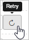

# Control

[!INCLUDE [Banner for top of topics](includes/banner.md)]

Puede aplicar acciones de gobernanza a los archivos de los usuarios en el entorno de la nube. Después de haber investigado exhaustivamente y aprendido sobre la nube, puede usar las acciones de gobernanza para ayudar a proteger la organización.

## Usar directivas para evaluar el riesgo

Después de echar un vistazo a las alertas abiertas, vaya al centro de directivas para revisar las infracciones de directivas que no han activado alertas.

- En el panel de Cloud App Security, haga clic en **Control** y, luego, en **Directivas**.

- Seleccione una directiva específica para ver la lista **Coincidiendo ahora** de coincidencias de directivas que no han activado alertas.

- Haga clic en las infracciones de una en una y decida qué hacer con cada una. Para más información sobre las acciones de gobernanza, vea las imágenes que aparecen aquí.

    Si la directiva está establecida para detectar infracciones de cumplimiento normativo y alguien guarda números de tarjetas de crédito en archivos en OneDrive, tendrá una coincidencia en la directiva.

    

- Seleccione la coincidencia para ver los archivos reales que han infringido la directiva.

    

    Puede seleccionar el propio archivo para obtener información sobre los archivos.

    Puede hacer clic en **Colaboradores** para ver quién tiene acceso a este archivo.

    Puede hacer clic en **Coincidencias** para ver los números de tarjeta de crédito reales.

    

## Aplicar acciones de gobernanza

Puede aplicar acciones de gobernanza desde las directivas, desde las alertas y desde el registro **Archivo**.

Puede revisar y ver el estado de todas las acciones de gobernanza aplicadas anteriormente en cualquier momento si va al icono de engranaje **Configuración** y selecciona **Registro de gobernanza**. 

Para volver a aplicar cualquier acción de gobernanza errónea, haga clic en el icono **Reintentar** para aplicarla de nuevo. 

Hay acciones de gobernanza distintas según el tipo de directiva, de infracción y de aplicación.

## Pasar de la detección a la corrección automática

Después de definir y personalizar los filtros de una directiva, puede seleccionar acciones de gobernanza automatizadas que se producirán tras cada infracción de esa directiva.
Puesto que las acciones correctoras utilizan las API del proveedor de la nube, pueden variar de una aplicación a otra.

> [!NOTE]
> Tenga especial cuidado al establecer las acciones de gobernanza, ya que pueden dar lugar a la pérdida irreversible de permisos de acceso a los archivos.
> Es recomendable restringir los filtros para representar exactamente los archivos en los que quiere actuar por medio de varios campos de búsqueda. Cuanto más restringidos sean los filtros, mejor.
>
> Para obtener orientación, puede utilizar el botón **Editar y obtener vista previa de resultados** de la sección **Filtros**.

## Migración

Cloud App Security le ayuda a implementar las migraciones, ya que le informa de qué usuarios de la organización usan una determinada aplicación y le ofrece herramientas para supervisar la adopción de aplicaciones nuevas. También puede ayudarle a decidir qué tipos de aplicaciones debe ofrecer en la organización al proporcionarle las herramientas para saber lo que todos los usuarios ya están usando.

### Migrar a los usuarios a una nueva aplicación

Imagínese esta situación: hace poco adquirió Office 365 y quiere que todos los usuarios de la organización dejen de usar todas las demás aplicaciones de almacenamiento en la nube y empiecen a usar OneDrive. Esto es lo que puede hacer:

1. Vaya al **panel de Cloud Discovery** y, en **Categorías de aplicaciones**, filtre las aplicaciones por **Almacenamiento en la nube**. Ordene los resultados por **Usuarios** o **Direcciones IP** y compruebe qué aplicación es la más popular.

2. Puede ver qué usuarios están usando otras aplicaciones. También puede explorar en profundidad esas aplicaciones y notificar a los usuarios que las utilizan que quiere que migren a OneDrive, de la siguiente forma:

    1. En el **panel de Cloud Discovery**, elija **Dropbox** y luego la ficha **Dirección IP** o **Usuarios**.

    2. Haga clic en el icono de flecha **Exportar** y elija las opciones de exportación. 

### Buscar alternativas más seguras

El catálogo de servicios de Cloud App Security puede ayudarle a encontrar alternativas adecuadas para la organización en sustitución de las aplicaciones de riesgo que los usuarios puedan estar utilizando.

Imagínese esta situación: está pensando en comprar una herramienta de productividad y no está seguro de si los usuarios la utilizarían.

1. Vaya al **panel de Cloud Discovery**.

2. En **Categorías**, filtre las aplicaciones por **Productividad**.

3. Consulte la **Puntuación** de cada aplicación en uso para ver si es segura y, si no es así, por qué no lo es.

4. Si decide que desea comprar una licencia empresarial para toda la organización, quizás desee observar también la columna **Usuarios**. Allí puede ver las aplicaciones más populares entre los usuarios, comprobar si son de confianza y ver las características de seguridad que tienen antes de tomar una decisión.

## Pasos siguientes

Para obtener información sobre cómo usar y configurar directivas para controlar el uso de la aplicación de la nube, consulte [Controlar las aplicaciones en la nube con directivas](control-cloud-apps-with-policies.md).

[!INCLUDE [Open support ticket](includes/support.md)]
