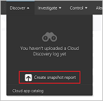
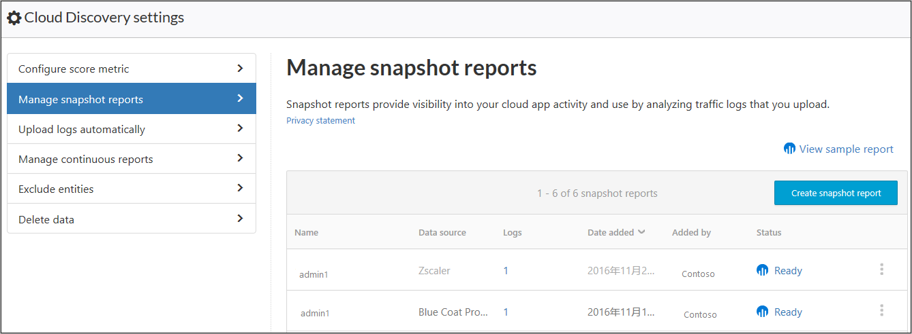

# Uso del analizador de registros personalizado

[!INCLUDE [Banner for top of topics](includes/banner.md)]

Cloud App Security le permite configurar un analizador personalizado para satisfacer y procesar el formato de los registros de modo que se puedan usar para Cloud Discovery. Normalmente usaría un analizador personalizado si Cloud App Security no admite explícitamente el firewall o el dispositivo. Puede tratarse de un analizador CSV o un analizador de clave-valor personalizado.

El analizador personalizado le permite utilizar registros de firewalls no admitidos siguiendo este proceso.

Para configurar un analizador personalizado:

1. En el portal de Cloud App Security, haga clic en **Detectar** y, después, en **Crear nuevo informe de instantáneas**.

    

2. Escriba un **nombre de informe** y una **Descripción**

3. En **Origen de datos**, seleccione **Custom log format...** (Formato de registro personalizado...).

    

4. Recopile archivos del firewall y el servidor proxy a través de los cuales los usuarios de la organización obtienen acceso a Internet. Asegúrese de recopilar registros durante períodos de tráfico pico que sean representativos de toda la actividad de usuario de la organización.

5. Abra los registros que quiere procesar en un editor de texto. Revise su formato, asegurándose de que los nombres de columna del registro se correspondan con los campos de la pantalla **Custom log format** (Formato de registro personalizado).

    

6. A continuación, rellene los campos de acuerdo con sus datos para delinear las columnas de datos que se relacionan con campos específicos de Cloud App Security. Tendrá que modificar los nombres de columna del archivo de registro para establecer correctamente la relación.

    > [!NOTE]
    > Estos campos distinguen mayúsculas de minúsculas. Asegúrese de escribir los nombres de las columnas de forma idéntica en Cloud App Security y en el archivo de registro. Además, asegúrese de que el formato de fecha seleccionado es idéntico.

    

7. Haga clic en **Save**(Guardar). El formato de registro personalizado que ha configurado se guardará como analizador personalizado de forma predeterminada. Puede editarlo en cualquier momento si hace clic en **Editar**.

8. En **Elija los registros de tráfico**, seleccione el archivo de registro que ha modificado y cárguelo. Puede cargar hasta 20 archivos a la vez. También se admiten archivos comprimidos y zip.

9. Haga clic en **Crear**.

10. Una vez finalizada la carga, aparecerá el mensaje de estado en la esquina superior derecha de la pantalla, que informa de que el registro se ha cargado correctamente.

11. Después de cargar los archivos de registro, pasará algún tiempo hasta que se redistribuyan y se analicen.
    Una vez completado el procesamiento de los archivos de registro, recibirá un correo electrónico que le notificará que ya está listo.

12. Aparecerá un banner de notificación en la barra de estado en la parte superior del **panel de Cloud Discovery**. El banner actualiza el estado de procesamiento de los archivos de registro.
    

13. Una vez cargados correctamente los registros, verá una notificación informándole de que el procesamiento de los archivos de registro se ha completado correctamente. En este punto, puede ver el informe. Para ello, haga clic en el vínculo de la barra de estado o vaya al icono de engranaje de configuración y seleccione **Cloud Discovery settings** (Configuración de Cloud Discovery).

    
14. Después, seleccione **Administrar los informes de instantáneas** y seleccione su informe de instantáneas.

    

## Pasos siguientes

> [!div class="nextstepaction"]
> [Crear informes de instantáneas de Cloud Discovery](create-snapshot-cloud-discovery-reports.md)

> [!div class="nextstepaction"]
> [Configurar la carga de registros automática para informes continuos](configure-automatic-log-upload-for-continuous-reports.md)

> [!div class="nextstepaction"]
> [Trabajo con datos de Cloud Discovery](working-with-cloud-discovery-data.md)

[!INCLUDE [Open support ticket](includes/support.md)]
