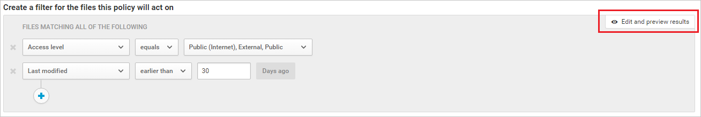

# Directivas de archivo  
Las directivas de archivo permiten aplicar una amplia gama de procesos automatizados, con lo que se aprovechan las API del proveedor en la nube. Las directivas se pueden establecer para proporcionar análisis de conformidad constantes, tareas de exhibición de documentos electrónicos legales, DLP para el contenido confidencial compartido públicamente y otros muchos casos de uso.  
Cloud App Security puede supervisar cualquier tipo de archivo basado en más de 20 filtros de metadatos (por ejemplo, nivel de acceso o tipo de archivo). 
 
**Tipos de archivo compatibles** 

Los motores de DLP integrados de Cloud App Security realizan la inspección de contenido mediante la extracción de texto de todos los tipos de archivo comunes (más de&100;), incluidos los de Office, Open Office, archivos comprimidos, varios formatos de texto enriquecido, XML, HTML y muchos más.

El motor combina tres aspectos en cada directiva:  
  
-   Análisis de contenido basado en plantillas preestablecidas o expresiones personalizadas.  
  
-   Filtros de contexto, incluidos roles de usuario, metadatos de archivos, nivel de uso compartido, integración de grupos organizativos, contexto de colaboración y otros atributos personalizables.  
  
-   Acciones automatizadas de gobierno y corrección. Para obtener más información, vea [Control](control.md).  
  
Una vez habilitada, la directiva analizará continuamente su entorno en la nube e identificará los archivos que coincidan con los filtros de contenido y el contexto y, seguidamente, aplicará las acciones automatizadas solicitadas. Estas directivas detectarán y corregirán cualquier infracción de la información en reposo o al crear contenido. Las directivas se pueden supervisar con alertas en tiempo real o con informes generados por la consola.  
  
Estos son algunos ejemplos de las directivas de archivo que se pueden crear:  
  
-   Archivos compartidos públicamente:  
    Reciba una alerta sobre cualquier archivo en la nube que se comparta públicamente; para ello, seleccione todos los archivos cuyo nivel de uso compartido sea público.  
  
-   Nombre de archivo compartido públicamente que contiene el nombre de la organización:  
    Reciba una alerta sobre cualquier archivo compartido públicamente que contenga el nombre de la organización. Seleccione los archivos compartidos públicamente cuyo nombre de archivo contenga el nombre de la organización.  
  
-   Uso compartido con dominios externos:  
    Reciba una alerta sobre cualquier archivo compartido con cuentas propiedad de determinados dominios externos (por ejemplo, un dominio de la competencia). Seleccione el dominio externo con el que quiera limitar el uso compartido.  
  
-   Poner en cuarentena archivos compartidos que no se han modificado durante el último período:  
    Reciba una alerta sobre los archivos compartidos que nadie haya modificado recientemente, con objeto de ponerlos en cuarentena u optar por activar una acción automatizada. Excluir todos los archivos privados que no se han modificado durante un intervalo de fechas especificado. En G Suite, puede poner en cuarentena estos archivos si activa la casilla para poner archivos en cuarentena de la página de creación de directivas.  
  
-   Uso compartido con usuarios no autorizados:  
    Reciba una alerta sobre los archivos que se comparten con un grupo de usuarios no autorizado de la organización. Seleccione los usuarios con los que el uso compartido está prohibido.  
  
-   Extensión de archivo confidencial:  
    Reciba una alerta sobre los archivos con extensiones específicas que puedan tener un nivel de exposición muy elevado. Seleccione el nombre de archivo o la extensión particular (por ejemplo, crt en el caso de los certificados) y excluya los que tengan un nivel de uso compartido privado.  
  
Haga lo siguiente para crear una directiva de archivo:  
  
1.  En la consola, haga clic en **Control**, seguido de **Directivas**.  
  
2.  Haga clic en **Crear directiva** y seleccione **Directiva de archivo**.  
  
3.  Asigne un nombre y una descripción a la directiva. Si quiere, puede basarla en una plantilla. Para obtener más información sobre las plantillas de directiva, vea [Controlar aplicaciones en la nube con directivas](control-cloud-apps-with-policies.md).  
  
4.  Dentro de **Tipo de riesgo**, vincule la directiva al tipo de riesgo más adecuado. Este campo es meramente informativo y solo sirve para encontrar más fácilmente directivas específicas y las consiguientes alertas, según el tipo de riesgo.  Puede que el riesgo ya esté seleccionado previamente según la categoría para la que eligió crear la directiva. Las directivas de archivo están configuradas como DLP de forma predeterminada.  
  
5.  Para definir qué aplicaciones van a activar esta directiva, **cree un filtro para los archivos sobre los que esta directiva actuará**. Limite los filtros de directiva hasta conseguir exactamente el conjunto de archivos sobre los que quiere actuar. Sea lo más restrictivo posible para evitar falsos positivos. Por ejemplo, si quiere quitar permisos públicos, agregue el filtro “Público”; si lo que quiere es quitar un usuario externo, use el filtro “Externo”, etc.  
> [!NOTE] 
> Al usar filtros de directiva, **Contiene** solo buscará palabras completas separadas por comas, puntos, espacios o caracteres de subrayado. Por ejemplo, si busca **malware** o **virus**, encontrará virus_malware_file.exe, pero no encontrará malwarevirusfile.exe. Si busca **malware.exe**, encontrará TODOS los archivos que contengan malware o exe en el nombre de archivo, mientras que si busca **"malware.exe"** (con comillas) solo encontrará los archivos que contengan exactamente "malware.exe". **Es igual a** solo buscará la cadena completa. Por ejemplo, si busca **malware.exe**, encontrará malware.exe pero no malware.exe.txt.  
6.  En Box, SharePoint, Dropbox y OneDrive, puede aplicar la directiva de archivo en todos los archivos en la aplicación o en carpetas específicas. En **Aplicar a**, seleccione **carpetas seleccionadas** o **todos los archivos excepto las carpetas seleccionadas**. Se le redirigirá para que inicie sesión en la aplicación en la nube. Tras ello, agregue las carpetas correspondientes.  
  
7.  Seleccione el **método de inspección de contenido**. El DLP integrado permite filtrar archivos por su contenido. Para examinar archivos en busca de contenido, seleccione **DLP integrado**. Una vez habilitada la inspección de contenido, puede optar entre usar expresiones preestablecidas o buscar otras expresiones personalizadas, como una subcadena o una [expresión regular](working-with-the-regex-engine.md) propia.  
    Además, puede especificar una expresión regular para excluir un archivo de los resultados. Esto es muy útil si tiene un estándar de palabra clave de clasificación interna que quiera excluir de la directiva.  
    También puede decidir cuál es el número mínimo de infracciones de contenido que debe producirse antes de que el archivo se considere una infracción. Por ejemplo, puede elegir 10 si quiere recibir alertas sobre archivos con al menos 10 números de tarjeta de crédito en su contenido.  
    Cuando el contenido se compara con la expresión seleccionada, el texto de la infracción se reemplazará por caracteres "X". De manera predeterminada, las infracciones se enmascaran completamente y se muestran en su contexto mostrando 40 caracteres antes y después de la infracción. Los números del contexto de la expresión se reemplazan por caracteres "#" y nunca se almacenan en Cloud App Security. Puede seleccionar la opción de **quitar máscara de los últimos 4 caracteres de una infracción** para mostrarlos.
  
8.  Elija las acciones de **gobierno** que quiera que Cloud App Security lleve a cabo cuando detecte una coincidencia.  
  
9. Una vez creada la directiva, puede verla en la pestaña **Directiva de archivo**. Una directiva siempre se puede modificar, calibrar sus filtros o cambiar las acciones automatizadas. La directiva se habilita automáticamente tras crearse e iniciará inmediatamente el análisis de los archivos en la nube.  
  
> [!NOTE]  
>  Tenga especial cuidado al definir acciones de gobierno, ya que podrían provocar la pérdida irreversible de permisos de acceso a los archivos.  
> Se recomienda restringir los filtros para representar exactamente los archivos en los que quiere actuar por medio de varios campos de búsqueda. Cuanto más restringidos sean los filtros, mejor.  
>   
>  Para obtener orientación, puede usar el botón **Editar y obtener vista previa de resultados** de la sección Filtros.  
  
   
  
10. Para ver coincidencias con la directiva de archivo, es decir, archivos sospechosos de infringir la directiva, haga clic en **Control** y, después, en **Directivas**. Filtre los resultados para mostrar solo las directivas de archivo con el filtro **Tipo** en la parte superior. Para obtener más información sobre las coincidencias de cada directiva, haga clic en una directiva. De este modo, se muestran los archivos que coinciden ahora con la directiva. Haga clic en la pestaña **Historial** para ver el historial de los 6 meses anteriores con los archivos que coincidieron con la directiva.     
  
## Referencia de directiva de archivo  
En esta sección se proporciona información de referencia sobre directivas, se ofrecen explicaciones sobre cada tipo de directiva y se detallan los campos que se pueden configurar para cada directiva. 
  
Una **directiva de archivo** es una directiva basada en API que permite controlar contenido en la nube de la organización. Para ello, se tienen en cuenta más de 20 filtros de metadatos de archivo (incluido el nivel de propietario y de uso compartido) y los resultados de inspección de contenido. En función de los resultados de la directiva, se pueden aplicar acciones de gobierno. El motor de inspección de contenido puede ampliarse mediante motores de DLP de terceros, así como soluciones antimalware.  
  
Cada directiva se compone de las siguientes partes:  
  
-   Filtros de archivo: permiten crear condiciones muy pormenorizadas basadas en metadatos.  
  
-   Inspección del contenido: permite restringir la directiva en función de los resultados del motor DLP. Puede incluir una expresión personalizada o una expresión preestablecida. Se pueden establecer exclusiones y puede elegir el número de coincidencias. También puede usar el anonimato para enmascarar el nombre de usuario. 
  
-   Acciones: la directiva proporciona un conjunto de acciones de gobierno que se pueden aplicar automáticamente cuando se detectan infracciones.  Se dividen en acciones de colaboración, las acciones de seguridad y acciones de investigación.

-   Extensions  
  
    > [!NOTE]  
    >  Las extensiones solo están disponibles con la versión Cloud App Security Technical Preview.  
  
    -  Es posible realizar una inspección del contenido mediante motores de terceros para DLP mejorada o funcionalidades antimalware.  
  
    -  Es posible realizar [acciones de gobierno](governance-actions.md) mediante motores de terceros para aplicar un control de cifrado personalizado u otros tipos de procesamiento de archivos (por ejemplo, marcas de agua personalizadas).  
  
## Consulte también  
[Actividades diarias para proteger el entorno de nube](daily-activities-to-protect-your-cloud-environment.md)   
[Para obtener soporte técnico, visite la página de soporte técnico asistido de Cloud App Security.](http://support.microsoft.com/oas/default.aspx?prid=16031)   
[Los clientes Premier también pueden elegir Cloud App Security directamente desde el Portal Premier.](https://premier.microsoft.com/)  
  
  