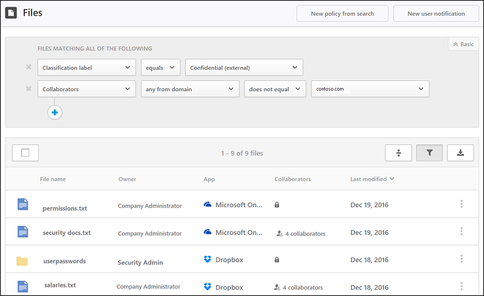
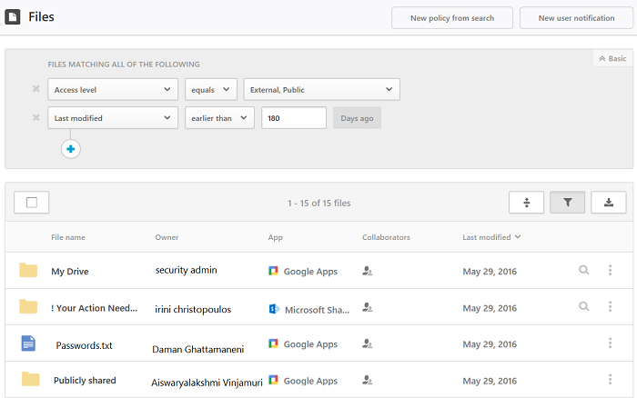

# Archivos

Para proporcionar protección de datos, Cloud App Security le ofrece visibilidad en todos los archivos de las aplicaciones conectadas. Después de conectar Cloud App Security a una aplicación mediante el conector de aplicaciones, Cloud App Security examina todos los archivos, por ejemplo, todos los archivos almacenados en OneDrive y Salesforce. Después, Cloud App Security vuelve a examinar cada archivo cada vez que se modifica (la modificación puede ser de contenido, metadatos o permisos de uso compartido). Los tiempos de examen dependen del número de archivos almacenados en la aplicación. También puede usar la página **Archivos** para filtrar archivos e investigar qué tipo de datos se guarda en las aplicaciones en la nube. 

Por ejemplo, puede usar la página **Archivos** para proteger de forma externa archivos compartidos etiquetados como **confidenciales** de la siguiente forma: después de conectar una aplicación a Cloud App Security, puede integrarla con Azure Information Protection. Después, en la página **Archivos**, filtre los archivos con la etiqueta **confidencial**. Si ve que hay archivos **confidenciales** compartidos fuera de su organización mediante el filtro **Colaboradores** para excluir su dominio, puede crear una directiva de archivo que detecte archivos **confidenciales** que tengan niveles de acceso incorrectos aplicados y efectuar acciones de regulación automáticas, como **Remove external collaborators** (Quitar colabores externos) y **Send policy-match digest to file owner** (Enviar resumen de directivas que coinciden al propietario del archivo) para evitar la pérdida de datos en la organización.

 

Este es otro ejemplo de cómo puede usar la página **Archivos**. Para asegurarse de que nadie de la organización comparta de forma pública o externa archivos que no se hayan modificado en los últimos 6 meses, después de conectar una aplicación a Cloud App Security, en la página **Archivos**, filtre por los archivos cuyo nivel de acceso sea **Externo** o **Público**, y establezca la fecha **Última modificación** en los 6 meses anteriores. Puede crear una directiva de archivo que detecte archivos obsoletos públicos haciendo clic en **New policy from search** (Nueva directiva de búsqueda) y aplicar acciones de regulación automática, como **Remove external users** (Quitar usuarios externos) para evitar que su organización pueda perder datos.

 

El filtro básico proporciona excelentes herramientas para empezar a filtrar los archivos.

 

Para profundizar en archivos más específicos, puede ampliar el filtro básico haciendo clic en Opciones avanzadas.

 
 
###   Filtros de archivo 
 
Cloud App Security puede supervisar cualquier tipo de archivo basado en más de 20 filtros de metadatos (por ejemplo, nivel de acceso o tipo de archivo). 
 
Los motores DLP integrados de Cloud App Security inspeccionan el contenido mediante la extracción de texto de los tipos de archivo comunes (PDF, archivos de Office, RTF, HTML, archivos de código, etc.).

A continuación se muestra una lista de los filtros de archivo que se pueden aplicar. La mayoría de los filtros admiten varios valores, así como NOT, para proporcionarle una herramienta muy eficaz para la creación de directivas.  
> [!NOTE] 
> Al usar filtros de directiva de archivo, **Contiene** solo buscará **palabras completas** separadas por comas, puntos, espacios o caracteres de subrayado. 
> - Los espacios entre palabras funcionan como el operador OR. Por ejemplo, si busca **malware** **virus**, se encontrarán todos los archivos con la palabra malware o virus en el nombre, como malware-virus.exe o virus.exe.  
> - Si quiere buscar una cadena, escriba las palabras entre comillas. Se tratarán como si usaran el operador AND. Por ejemplo, si busca **"malware"** **"virus"**, se encontrará virus_malware_file.exe, pero no se encontrarán ni malwarevirus.exe ni malware.exe. En cambio, buscará la cadena exacta. Si busca **"malware virus"** no encontrará **"virus"** ni **"virus_malware"**.

>**Es igual a** solo buscará la cadena completa. Por ejemplo, si busca **malware.exe**, encontrará malware.exe pero no malware.exe.txt. 

-   Nivel de acceso: nivel de acceso de recursos compartidos (público, externo, interno o privado).  Para obtener más información sobre los archivos externos, consulte [General Setup, Set up the portal](getting-started-with-cloud-app-security.md) (Configuración general, Configurar el portal). Los archivos internos son los que se encuentran dentro de los dominios internos que haya establecido en [General setup](General-setup.md) (Configuración general). Los archivos externos son los que están guardados en ubicaciones que no se encuentran dentro de los dominios internos que haya establecido. Los archivos compartidos son los que tienen un nivel de uso compartido superior a privado. Esto incluye uso compartido interno (archivos compartidos dentro de los dominios internos), uso compartido externo (archivos compartidos en dominios que no se muestran en los dominios internos), público con un vínculo (archivos que se pueden compartir con cualquier usuario a través de un vínculo) y público (archivos que se pueden encontrar al realizar búsquedas en Internet). 

> [!NOTE]
>  Cloud App Security controla los archivos compartidos en las aplicaciones de almacenamiento conectadas a usuarios externos de la forma siguiente:
> - **OneDrive:** OneDrive asigna un usuario interno como propietario de cualquier archivo colocado en su OneDrive por un usuario externo. Dado que, a partir de ese momento, se considera que estos archivos pertenecen a la organización, Cloud App Security los examina y les aplica directivas, tal como hace con cualquier otro archivo de OneDrive.
> - **Google Drive:** Google Drive considera que pertenecen al usuario externo y, debido a las restricciones legales relativas a los archivos y los datos que no pertenecen a la organización, Cloud App Security no tiene acceso a estos archivos.
> - **Box:** dado que Box considera que los archivos de propiedad externa son información privada, los administradores globales de Box no pueden ver el contenido de los archivos. Por este motivo, Cloud App Security no tiene acceso a estos archivos. 
> - **Dropbox:** dado que Dropbox considera que los archivos de propiedad externa son información privada, los administradores globales de Dropbox no pueden ver el contenido de los archivos. Por este motivo, Cloud App Security no tiene acceso a estos archivos.

-   Aplicación: solo busca archivos dentro de estas aplicaciones.  
  
-   Colaboradores: incluye/excluye grupos de colaboradores específicos.  
  
    -   Cualquiera del dominio: indica si algún usuario de este dominio tiene acceso al archivo.  
  
    -   Dominio completo: indica si el dominio completo tiene acceso al archivo.  
  
    -   Grupos: indica si un grupo específico tiene acceso al archivo. Se pueden importar grupos de Active Directory o de aplicaciones en la nube, o bien crearse manualmente en el servicio.  
  
    -   Usuarios: conjunto determinado de usuarios que pueden tener acceso al archivo.  
  
-   Creado: hora de creación de archivo. El filtro admite fechas antes y después e intervalos de fechas.  
  
-   Extensión: se centra en extensiones de archivo específicas, por ejemplo, todos los archivos que son ejecutables (exe).  
  
-   Id. de archivo: busca identificadores de archivo específicos. Se trata de una característica avanzada que permite hacer un seguimiento de determinados archivos de gran valor sin depender de su propietario/ubicación/nombre.  
  
-   Nombre de archivo: nombre de archivo o subcadena del nombre tal como se define en la aplicación en la nube, por ejemplo, Todos los archivos con una contraseña en su nombre.   
  
-   Etiqueta de clasificación: busca archivos con etiquetas específicas establecidas por Azure Information Protection. Esto requiere la integración con Azure Integration Protection.

-   Tipo de archivo: Cloud App Security toma el tipo MIME recibido del servicio y examina el archivo para determinar el tipo de archivo real. Tenga en cuenta que este examen se aplica a archivos pertinentes para el examen de datos (documentos, imágenes, presentaciones, hojas de cálculo, archivos de texto y archivos de almacenamiento o ZIP). El filtro funciona por tipo de archivo/carpeta, por ejemplo, Todas las carpetas que son… o Todos los archivos de hoja de cálculo que son...

   

  
-   En la papelera: excluye/incluye archivos que se encuentran en la carpeta de la papelera. Estos archivos siguen pudiendo compartirse y suponen un riesgo.  
  
-   Última modificación: hora de modificación del archivo. El filtro admite valores de fecha Antes de/Después de, intervalos de fechas y expresiones de tiempo relativo, por ejemplo, Todos los archivos que no se han modificado en los últimos 6 meses.  

-   Directiva coincidente: archivos que coinciden gracias a una directiva de Cloud App Security.

-   Tipo MIME: comprobación del tipo MIME del archivo. Acepta el texto sin formato.  
  
-   Propietario: incluye/excluye propietarios de archivo específicos, por ejemplo, Realizar un seguimiento de todos los archivos compartidos por rogue_employee_#100.  
  
-   UO del propietario: incluye/excluye los propietarios de archivos que pertenecen a determinado grupo de la organización, por ejemplo, Todos los archivos públicos excepto los compartidos por EMEA_marketing.  
  
-   Carpeta principal: incluye/excluye en función de la carpeta principal, por ejemplo, Todos los archivos compartidos públicamente excepto los archivos de esta carpeta.  
  
-   En cuarentena: indica si el servicio ha puesto el archivo en cuarentena, por ejemplo, Mostrar todos los archivos que estén en cuarentena.  
  
También puede establecer que la directiva se ejecute en archivos específicos. Para ello, establezca el filtro **Aplicar a** en Todos los archivos, Carpetas seleccionadas o Todos los archivos excepto las carpetas seleccionadas y, después, seleccione los archivos o las carpetas pertinentes.  
  
  
  
## Uso del cajón de archivos

Puede ver más información sobre un archivo haciendo clic en él en el registro de archivos. El cajón de archivos se abrirá con las siguientes acciones adicionales relacionadas con el archivo en cuestión:

- Dirección URL: le lleva a la ubicación del archivo.
- Identificadores de archivos: si hace clic en uno, se abrirá una ventana emergente con los datos sin procesar sobre el archivo, como su id. o las claves de cifrado.
- Propietario: haga clic en esta opción para ver la página de usuario del propietario del archivo.
- Directivas coincidentes: haga clic en este vínculo para ver una lista de las directivas con las que coincida el archivo.
- Etiqueta de clasificación: haga clic en esta opción para ver una lista de etiquetas de clasificación de Azure Information Protection que se hayan encontrado en este archivo. A continuación, podrá filtrar todos los archivos que coincidan con esta etiqueta.    

  
  
Para obtener una lista de las acciones de gobierno disponibles, consulte [Acciones de gobierno de archivos](governance-actions.md#file-governance-actions).

## Consulte también  
[Actividades diarias para proteger el entorno de nube](daily-activities-to-protect-your-cloud-environment.md)   
[Para obtener soporte técnico, visite la página de soporte técnico asistido de Cloud App Security.](http://support.microsoft.com/oas/default.aspx?prid=16031)   
[Los clientes Premier también pueden elegir Cloud App Security directamente desde el Portal Premier.](https://premier.microsoft.com/)  
  
  