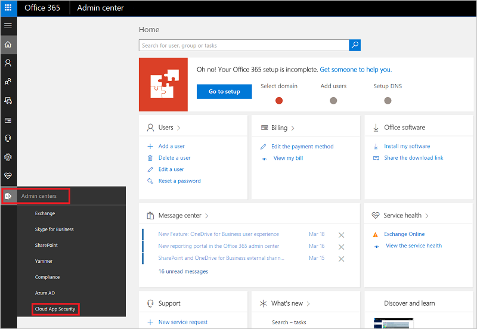

# Implementación de Microsoft Cloud App Security

*Se aplica a: Microsoft Cloud App Security*

Microsoft Cloud App Security le puede ayudar a sacar partido de las ventajas de las aplicaciones en la nube a la vez que mantiene el control de los recursos corporativos. Funciona mejorando la visibilidad de la actividad en la nube y ayuda a aumentar la protección de los datos corporativos. En este artículo, le indicaremos los pasos que debe llevar a cabo para configurar y trabajar con Microsoft Cloud App Security.  

Su organización debe tener una licencia para utilizar Cloud App Security. Para obtener más información, consulte la sección [Cómo comprar Cloud App Security](https://www.microsoft.com/cloud-platform/cloud-app-security) en la página principal de Cloud App Security.  

>[!NOTE]
>No necesita una licencia de Office 365 para usar Cloud App Security.  

## Requisitos previos  
  
- Para usar el producto, la organización debe tener una licencia de Cloud App Security. Para obtener más información, consulte la sección [Cómo comprar Cloud App Security](https://www.microsoft.com/cloud-platform/cloud-app-security) en la página principal de Cloud App Security.  
  
     Para obtener soporte para activar inquilinos, vea [Póngase en contacto con el soporte de Office 365 para empresas: ayuda para administradores](https://support.office.com/article/Contact-Office-365-for-business-support-Admin-Help-32a17ca7-6fa0-4870-8a8d-e25ba4ccfd4b).  
- Después de haber adquirido una licencia para Cloud App Security, recibirá un correo electrónico con la información de activación y un vínculo al portal de Cloud App Security.  
  
- Para configurar Cloud App Security, debe ser un administrador global, un administrador de cumplimiento o un Lector de seguridad de Azure Active Directory u Office 365. Es importante comprender que un usuario que tenga asignado un rol de administrador tendrá los mismos permisos en todas las aplicaciones de nube a las que se haya suscrito la organización. Esto es así independientemente de si ha asignado el rol en el portal de Office 365, en el portal clásico de Azure o mediante el módulo de Azure AD para [Windows PowerShell](https://technet.microsoft.com/library/mt736914.aspx). Para obtener más información, vea [Asignación de roles de administrador en Office 365](https://support.office.com/article/Assigning-admin-roles-in-Office-365-eac4d046-1afd-4f1a-85fc-8219c79e1504) y [Asignación de roles de administrador en Azure Active Directory (Azure AD)](https://azure.microsoft.com/documentation/articles/active-directory-assign-admin-roles/).  
  
- Para ejecutar el portal de Cloud App Security, use Internet Explorer 11, Microsoft Edge (versión más reciente), Google Chrome (versión más reciente), Mozilla Firefox (versión más reciente) o Apple Safari (versión más reciente).  

## Para acceder al portal:

Para tener acceso al portal de Cloud App Security, vaya a [ https://portal.cloudappsecurity.com](https://portal.cloudappsecurity.com).  
También puede acceder al portal a través del **Centro de administración de Office 365** si hace clic en el icono Centros de administración.  Después, seleccione **Cloud App Security**.  
  
  
  

## Inicio rápido de Cloud App Security  

 

### Paso 1. [Establezca la visibilidad, la protección y las acciones de gobierno instantáneas para las aplicaciones](enable-instant-visibility-protection-and-governance-actions-for-your-apps.md).
Tarea necesaria: conectar aplicaciones

1. En el engranaje de configuración, seleccione **Conectores de aplicaciones**.
2. Haga clic en el signo más para agregar una aplicación y seleccione una aplicación.
3. Siga los pasos de configuración para conectar la aplicación.

**¿Por qué conectar una aplicación?**
Después de conectar una aplicación, puede obtener una mayor visión para que pueda investigar actividades, archivos y cuentas para las aplicaciones en su entorno de la nube.

### Paso 2. [Controle las aplicaciones en la nube con directivas](control-cloud-apps-with-policies.md).
Tarea necesaria: crear directivas

**Para crear directivas**

1. Vaya a **Control** > **Plantillas**.
2. Seleccione una plantilla de directiva de la lista y elija (+) **Crear directiva**.
3. Personalice la directiva (seleccione filtros, acciones y otras configuraciones) y luego elija **Crear**.
4. En la ficha **Directivas**, elija la directiva para ver las coincidencias relevantes (actividades, archivos y alertas).
 Sugerencia: a fin de cubrir todos los escenarios de seguridad del entorno de la nube, cree una política para cada **categoría de riesgo**.

**¿Cómo pueden las directivas ayudar a la organización?**
Puede utilizar directivas para ayudarle a supervisar tendencias, ver amenazas de seguridad y generar alertas e informes personalizados. Con las directivas se pueden crear acciones de gobierno y establecer controles de uso compartido de archivos y de prevención de pérdida de datos.

### Paso 3. [Configure Cloud Discovery](set-up-cloud-discovery.md).

Tarea necesaria: Habilitar Cloud App Security ver el uso de la aplicación en la nube

1. [Integración con ATP de Windows Defender](wdatp-integration.md) para habilitar automáticamente Cloud App Security para que supervise los dispositivos Windows 10 dentro y fuera de la corporación.
2. Si usa [Zscaler](zscaler-integration.md), intégrelo con Cloud App Security.
3. Para lograr cobertura completa, cree un informe continuo de Cloud Discovery

   1. En el engranaje de configuración, seleccione **Configuración de Cloud Discovery**.
   2. Elija **Carga automática del registro**.
   3. En la ficha **Orígenes de datos**, agregue los orígenes.
   4. En la pestaña **Recopiladores de registros**, configure el recopilador de registros.
 
**Para crear un informe de instantáneas de Cloud Discovery**

 Vaya a **Detectar** > **Informe de instantáneas** y siga los pasos indicados.

**¿Por qué se deben configurar los informes de Cloud Discovery?**
Tener visibilidad de la TI en la sombra de la organización es algo esencial.
Después de analizar los registros, podrá detectar fácilmente qué aplicaciones en la nube se usan, qué usuarios lo hacen y en qué dispositivos.

### Paso 4. [Personalice la experiencia](mail-settings.md).
Tarea necesaria: agregar detalles de su organización

**Para especificar la configuración de correo electrónico**

1. 1. En el engranaje de configuración, seleccione **Configuración de correo electrónico**.
2. En **Identidad del emisor de correo electrónico**, escriba las direcciones de correo electrónico y el nombre para mostrar.
3. En **Diseño del correo electrónico**, cargue la plantilla de correo electrónico de la organización.

**Para establecer notificaciones de administrador**

1. En la barra de navegación, seleccione el nombre de usuario y luego vaya a **Configuración de usuario**.
2. En **Notificaciones**, configure los métodos que quiere establecer para las notificaciones del sistema.
3. Elija **Guardar**.

**Para personalizar las métricas de puntuación**

1. En el engranaje de configuración, seleccione **Configuración de Cloud Discovery**.
1. En el engranaje de configuración, seleccione **Configuración de Cloud Discovery**.
2. En **Métricas de puntuación**, configure la importancia de los distintos valores de riesgo.
3. Elija **Guardar**.

Ahora las puntuaciones de riesgo otorgadas a las aplicaciones detectadas están configuradas exactamente según las necesidades y las prioridades de la organización.

**¿Por qué personalizar el entorno?**
Algunas características funcionan mejor si se personalizan de acuerdo a las necesidades. Ofrezca una mejor experiencia a los usuarios con sus propias plantillas de correo electrónico. Decida qué notificaciones recibe y personalice las métricas de puntuación de riesgo de modo que se ajusten a las preferencias de la organización.

### Paso 5. [Organice los datos de acuerdo a las necesidades](ip-tags.md).
Tarea necesaria: configurar opciones importantes

**Para crear etiquetas de dirección IP**

1. En el engranaje de configuración, seleccione **Configuración de Cloud Discovery**.
1. En el engranaje de configuración, seleccione **Intervalos de direcciones IP**.
2. Haga clic en el signo más para agregar un intervalo de direcciones IP.
3. Escriba los **detalles**, la **ubicación**, las **etiquetas** y la **categoría** del intervalo IP.
4. Elija **Crear**.

   Ahora puede usar etiquetas IP cuando cree directivas y cuando filtre y cree informes continuos.

**Para crear informes continuos**

1. En el engranaje de configuración, seleccione **Configuración de Cloud Discovery**.
2. En **Informes continuos**, elija **Crear informe**.
3. Siga los pasos de configuración.
4. Elija **Crear**.

Ahora puede ver datos detectados según sus propias preferencias, por ejemplo, unidades de negocio o intervalos IP.

**Para agregar dominios**

1. En el engranaje de configuración, seleccione **Configuración**.
2. En **Detalles de la organización**, agregue los dominios internos de la organización.
3. Elija **Guardar**.

**¿Por qué se deben configurar estos valores?**
Estos valores le ayudan a controlar mejor las características de la consola. Con las etiquetas IP es más fácil crear directivas adaptadas a las propias necesidades, filtrar con precisión los datos, etc. Use vistas de datos para agrupar los datos en categorías lógicas.
  

## Consulte también

Establezca directivas: [Controlar las aplicaciones en la nube con directivas](control-cloud-apps-with-policies.md).    

[Los clientes Premier también pueden crear una nueva solicitud de soporte técnico directamente en el portal Premier.](https://premier.microsoft.com/)   
