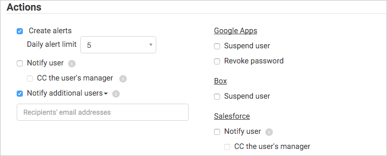

# Control de aplicaciones conectadas
El gobierno le permite controlar qué hacen los usuarios en tiempo real en varias aplicaciones. Para las aplicaciones conectadas, puede aplicar acciones de gobierno a archivos o actividades.
Las acciones de gobierno son acciones que puede ejecutar en archivos o actividades directamente desde Cloud App Security para controlar qué hacen los usuarios en tiempo real en las aplicaciones conectadas. 

### Acciones de gobierno relacionadas con archivos  

Las siguientes acciones de gobierno pueden realizarse para aplicaciones conectadas en un archivo o usuario específico o bien desde una directiva concreta.
  
-   Notificaciones  
  
    -   Alertas: las alertas pueden desencadenarse en el sistema y propagarse a través de mensajes de correo electrónico y de texto, según el nivel de gravedad.  
  
    -   Notificación de correo electrónico de usuario: es posible personalizar los mensajes de correo electrónico y enviarlos a todos los propietarios de archivos infractores.  
  
    -   Administrador de CC: según la integración de directorios del usuario, también se pueden enviar notificaciones de correo electrónico al administrador de la persona que haya infringido una directiva. (Solo Salesforce)
  
-   Enviar una notificación a usuarios concretos: lista específica de direcciones de correo electrónico que recibirán las notificaciones.  
  
-   Enviar una notificación al último editor del archivo: se envían notificaciones a la última persona que ha modificado el archivo.  
  
-   Acciones de gobierno en aplicaciones  
  
     Se pueden aplicar acciones pormenorizadas por aplicación. Las acciones específicas varían según la terminología de la aplicación.  
  
    -   Cambio del uso compartido  
  
        -   Quitar el uso compartido público: permite el acceso únicamente a los colaboradores con nombre, por ejemplo, Quitar el acceso público a G Suite y Quitar el vínculo compartido directo a Box.  
  
        -   Quitar usuarios externos: permite el acceso únicamente a los usuarios de la empresa.  
  
        -   Convertir en privado: solo el propietario puede tener acceso al archivo. Se quitan todos los recursos compartidos.  
  
        -   Quitar un colaborador: quita un colaborador específico del archivo.  

        - Reducir el acceso público: permite establecer que los archivos disponibles públicamente solo estén disponibles con un vínculo compartido.
  
    -   Cuarentena  
  
        -   Poner en cuarentena de usuario: permite el autoservicio moviendo el archivo a una carpeta de cuarentena controlada por el usuario.  
  
        -   Poner en cuarentena de administrador: el archivo se pone en cuarentena en la unidad del administrador y este tiene que aprobarlo.  
  
-   Heredar permisos del primario: esta acción de control le permite quitar el conjunto de permisos específicos para un archivo o carpeta en Office 365 y revertirlos a los permisos establecidos para la carpeta principal.
-   Enviar a la papelera: el archivo se mueve a la carpeta de la papelera.
  
  
  
 
### Acciones de control de actividades  

- Notificaciones  
  
    -   Alertas: las alertas pueden desencadenarse en el sistema y propagarse a través de mensajes de correo electrónico y de texto, según el nivel de gravedad.  
  
    -   Notificación de correo electrónico de usuario: es posible personalizar los mensajes de correo electrónico y enviarlos a todos los propietarios de archivos infractores.  
  
    -   Administrador de CC: según la integración de directorios del usuario, también se pueden enviar notificaciones de correo electrónico al administrador de la persona que haya infringido una directiva. (Solo Salesforce)
  
    -   Enviar una notificación a usuarios adicionales: lista específica de direcciones de correo electrónico que recibirán las notificaciones.  
  
- Acciones de gobierno en aplicaciones  
  
    -   Se pueden aplicar acciones granulares por aplicación. Las acciones específicas varían según la terminología de la aplicación.  
  
    -   Suspender usuario: se suspende al usuario de la aplicación. 
    > [!NOTE] 
    > Si Azure Active Directory está establecido de modo que se sincronice automáticamente con los usuarios del entorno local de Active Directory, la configuración del entorno local reemplazará la configuración de Azure AD y esta acción de gobierno se revertirá. 
  
    -   Revocar contraseña: se revoca la contraseña del usuario y se le obliga a establecer una nueva en el siguiente inicio de sesión.  
  
       
  

### Conflictos de gobierno

Después de crear varias directivas, puede darse el caso de que sus acciones de gobierno se superpongan. Si es así, Cloud App Security procesará las acciones de gobierno de la manera siguiente:

#### Conflictos entre directivas

- Si dos directivas contienen acciones que forman parte de la otra directiva (por ejemplo, **Quitar recursos compartidos externos** se incluye en **Hacer privado**), Cloud App Security resolverá el conflicto y se aplicará la acción más restrictiva.
- Si las acciones no tienen ninguna relación (por ejemplo, **Enviar una notificación al propietario** y **Hacer privado**), se llevarán a cabo ambas acciones.
- Si las acciones entran en conflicto (por ejemplo **Cambiar el propietario al usuario A** y **Cambiar el propietario al usuario B**), pueden darse resultados diferentes para cada coincidencia. Es importante cambiar las directivas para evitar conflictos, ya que pueden producir cambios no deseados en la unidad que serán difíciles de detectar.

#### Conflictos en la sincronización de usuarios

- Si Azure Active Directory está establecido de modo que se sincronice automáticamente con los usuarios del entorno local de Active Directory, la configuración del entorno local reemplazará la configuración de Azure AD y esta acción de gobierno se revertirá. 

### Registro de gobierno
El registro de gobierno proporciona un registro del estado de cada tarea que Cloud App Security deba ejecutar, incluidas las tareas manuales y automáticas. Entre estas tareas se incluyen las tareas definidas en las directivas, las acciones de gobierno establecidas en los archivos y los usuarios, y cualquier otra acción que haya determinado que debe realizar Cloud App Security. El registro de gobierno también proporciona información sobre el resultado correcto o incorrecto de estas acciones. Puede volver a intentar o revertir algunas de las acciones de gobierno en el registro de gobierno. 

A continuación se muestra una lista completa de las acciones que Cloud App Security permite realizar. Estas acciones se habilitarán en varios lugares de la consola, según se desprende de la columna **Ubicación**. Cada acción de gobierno realizada se incluye en el registro de gobierno.
Para obtener información sobre cómo se tratan las acciones de control cuando hay conflictos de directivas, vea [Policy Conflicts](control-cloud-apps-with-policies.md) (Conflictos de directivas).

**Ubicación**|**Tipo de objeto de destino**|**Acción de gobierno**|**Descripción**|**Conectores relacionados** 
---------|---------|---------|---------|---------
|Cuentas|Archivo|Quitar las colaboraciones del usuario|Se quitan todas las colaboraciones de un usuario específico en cualquiera de los archivos. Resulta conveniente cuando las personas dejan la empresa.|Box, G Suite|
|Cuentas|Cuenta|Anular la suspensión del usuario|Se anula la suspensión del usuario.|G Suite, Box, Office, Salesforce|
|Cuentas|Cuenta|Configuración de la cuenta|Le lleva a la página de configuración de la cuenta de la aplicación específica (por ejemplo, Salesforce).|Todas las aplicaciones (la configuración de One Drive y SharePoint se establece en Office).|
|Cuentas |Archivo|Transferir la propiedad de todos los archivos|En una cuenta, todos los archivos de un usuario se transfieren para pasar a pertenecer a una nueva persona de su elección. El propietario anterior se convierte en editor y ya no podrá cambiar la configuración de uso compartido. El nuevo propietario recibirá una notificación por correo relativa al cambio de propiedad.|G Suite|
|Cuentas, Directiva de actividad|Cuenta|Suspender usuario|El usuario se configura de forma que no tiene acceso ni la posibilidad de iniciar sesión. Si este usuario ya ha iniciado sesión cuando define esta opción, se le bloqueará inmediatamente.|G Suite, Box, Office, Salesforce|
|Directiva de actividad, Cuentas|Cuenta|Revocar contraseña|Se revoca la contraseña de una cuenta de usuario; por ejemplo, establecer una directiva de actividad que revoca una contraseña tras 10 intentos de inicio de sesión infructuosos.|G Suite|
|Directiva de actividad, Cuentas|Cuenta|Revocar privilegios de administrador|Se revocan los privilegios de una cuenta de administrador; por ejemplo, establecer una directiva de actividad que revoca los privilegios de administrador tras 10 intentos de inicio de sesión infructuosos.|G Suite|
|Panel de la aplicación > Permisos de aplicación|Permisos|Eliminar la prohibición de una aplicación|En Google y Salesforce: quite la prohibición de una aplicación y permita que los usuarios concedan permisos a la aplicación de terceros con Google o Salesforce. En Office 365: se restauran los permisos de la aplicación de terceros para acceder a Office.|G Suite, Salesforce, Office|
|Panel de la aplicación > Permisos de aplicación|Permisos|Deshabilitar permisos de aplicación|Revoque los permisos de una aplicación de terceros para acceder a Google, Salesforce u Office. Se trata de una acción única que se producirá en todos los permisos existentes, pero no impedirá las conexiones futuras. |G Suite, Salesforce, Office|
|Panel de la aplicación > Permisos de aplicación|Permisos|Habilitar permisos de aplicación|Conceda los permisos de una aplicación de terceros para acceder a Google, Salesforce u Office. Se trata de una acción única que se producirá en todos los permisos existentes, pero no impedirá las conexiones futuras. |G Suite, Salesforce, Office|
|Panel de la aplicación > Permisos de aplicación|Permisos|Prohibir una aplicación|En Google y Salesforce: revoque los permisos que tiene una aplicación de terceros en Google o Salesforce y prohíba que reciba permisos en el futuro. En Office 365: no se puede conceder permiso a aplicaciones de terceros para que accedan a Office, pero no se pueden revocar.|G Suite, Salesforce, Office|Directiva de archivo|Archivo|Restringir solo para colaboradores|Únicamente los colaboradores designados pueden tener acceso al archivo.|Cuadro|
|Panel de la aplicación > Permisos de aplicación|Permisos|Revocar aplicación|Revoque los permisos de una aplicación de terceros para acceder a Google o Salesforce. Se trata de una acción única que se producirá en todos los permisos existentes, pero no impedirá las conexiones futuras.|G Suite, Salesforce|
|Panel de la aplicación > Permisos de aplicación|Cuenta|Revocar usuario de la aplicación|Se pueden revocar usuarios específicos al hacer clic en el número bajo Usuarios. La pantalla mostrará los usuarios específicos y puede usar la X para eliminar los permisos para cualquiera de ellos.|G Suite, Salesforce|
|Detectar > Aplicaciones detectadas/Direcciones IP/Usuarios|Cloud Discovery|Exportar datos de detección|Se crea un archivo CSV a partir de los datos de detección.|Detección|
|Directiva de archivo|Archivo|Enviar a la papelera|Coloca el archivo en la papelera del usuario.|One Drive, SharePoint|
|Directiva de archivo|Archivo|Enviar una notificación al último editor del archivo|Se envía un correo para informar a la última persona que editó el archivo de que este infringe una directiva.|G Suite, Box|
|Directiva de archivo|Archivo|Enviar una notificación al propietario del archivo|Envía un correo electrónico al propietario del archivo cuando se infringe una directiva. En Dropbox, si no hay ningún propietario asociado a un archivo, la notificación se enviará al usuario específico que establezca.|Todas las aplicaciones|
|Directiva de archivo, Directiva de actividad|Archivo, Actividad|CC del administrador del propietario o del usuario|Cuando el propietario del archivo recibe una notificación por correo en la que se le informa de que su archivo infringe una directiva, opcionalmente se notifica también al administrador del propietario o usuario del archivo.|Salesforce|
|Directiva de archivo, Directiva de actividad|Archivo, Actividad|Enviar una notificación a usuarios concretos|Se envía un correo para informar a determinados usuarios de que un archivo infringe una directiva.|Todas las aplicaciones|
|Directiva de archivo y Directiva de actividad|Archivo, Actividad|Enviar notificación al usuario|Se envía un correo a los usuarios para informarles de que algo que han hecho o un archivo que poseen infringe una directiva. Se puede agregar una notificación personalizada que indique en qué consistió la infracción.|Todos|
|Directiva de archivo y archivos|Archivo|Quitar la capacidad de compartir de los editores|En Google Drive, los permisos de editor predeterminados de un archivo permiten también compartir ese archivo. Esta acción de gobierno restringe esta opción y limita el uso compartido del archivo al propietario.|G Suite|
|Directiva de archivo y archivos|Archivo|[Poner en cuarentena de administrador](use-case-admin-quarantine.md)|Se quitan todos los permisos del archivo y el archivo se mueve a una carpeta de cuarentena en una ubicación para el administrador. De este modo, el administrador puede revisar el archivo y quitarlo.|Office 365 SharePoint, OneDrive para la Empresa, Box|
|Directiva de archivo y archivos|Archivo|Aplicar etiqueta de clasificación|Se aplica una etiqueta de clasificación de Azure Information Protection a los archivos de forma automática en función de las condiciones establecidas en la directiva.|Box, One Drive, SharePoint|
|Directiva de archivo y archivos|Archivo|Quitar etiqueta de clasificación|Se quita una etiqueta de clasificación de Azure Information Protection de los archivos de forma automática en función de las condiciones establecidas en la directiva.|Box, One Drive, SharePoint|
|Directiva de archivo, Directiva de actividad, Alertas|Aplicación|Requerir a los usuarios que inicien sesión de nuevo|Puede requerir a los usuarios que inicien sesión de nuevo en todas las aplicaciones de Office 365 y Azure AD como una solución rápida y eficaz en el caso de alertas de actividad sospechosa del usuario y cuentas en peligro. Encontrará la nueva acción de gobierno en la configuración de directiva y las páginas de alertas, junto a la opción Suspender usuario.|Office 365, Azure AD|
|Archivos|Archivo|Restaurar de la cuarentena de usuario|Se restaura un usuario que estaba en cuarentena.|Cuadro|
|Archivos|Archivo|Concederme permisos de lectura|Se concede permisos de lectura para el archivo a sí mismo con el fin de tener acceso al archivo y saber si existe o no una infracción en él.|G Suite|
|Archivos|Archivo|Permitir que los editores compartan|En Google Drive, los permisos de editor predeterminados de un archivo permiten también compartir ese archivo. Esta acción de gobierno hace lo contrario de “Quitar la capacidad de compartir de los editores” y permite que el editor comparta el archivo.|G Suite|
|Archivos|Archivo|Proteger|Proteja un archivo con Azure Information Protection aplicando una plantilla de la organización.|Office 365 (SharePoint y OneDrive)|
|Archivos|Archivo|Revocar mis propios permisos de lectura|Se revocan los permisos de lectura para el archivo de uno mismo. Esto es útil después de haberse concedido permisos manualmente para saber si un archivo tiene o no una infracción.|G Suite|
|Archivos, Directiva de archivo|Archivo|Transferir la propiedad de los archivos|Se cambia el propietario: en la directiva se elige un propietario específico.|G Suite|
|Archivos, Directiva de archivo|Archivo|Reducir el acceso público|Esto le permite establecer que los archivos disponibles públicamente solo estén disponibles con un vínculo compartido.|G Suite|
|Archivos, Directiva de archivo|Archivo|Quitar un colaborador|Se quita un colaborador específico de un archivo.|G Suite, Box, One Drive, SharePoint|
|Archivos, Directiva de archivo|Archivo|Convertir en privado|El archivo se convierte en privado: no hay más colaboradores ni vínculos públicos, ni se comparte con nadie.|G Suite, One Drive, SharePoint|
|Archivos, Directiva de archivo|Archivo|Quitar usuarios externos|Se quitan todos los colaboradores externos de los dominios configurados como internos en la configuración.|G Suite, Box |
|Archivos, Directiva de archivo|Archivo|Conceder permisos de lectura para el dominio|Se conceden permisos de lectura para el archivo en el dominio especificado, ya sea en todo el dominio o en un dominio específico. Esto podría ser útil si quiere quitar el acceso público tras conceder acceso al dominio a personas que necesitan trabajar en él.|G Suite|
|Archivos, Directiva de archivo|Archivo|Poner en cuarentena de usuario|Se quitan todos los permisos del archivo y el archivo se mueve a una carpeta de cuarentena en la unidad raíz del usuario. De este modo, el usuario puede revisar el archivo y moverlo. Si se mueve de vuelta manualmente, no se restaura el uso compartido de archivos.|Box, One Drive, SharePoint|
|Archivos, Directiva de archivo|Archivo|Quitar el acceso público|Si pone un archivo suyo como de acceso público, pasa a ser accesible solo para quien esté configurado para tener acceso a él, según el tipo de acceso tuviera el archivo. |G Suite|
|Archivos, Directiva de archivo|Archivo|Quitar el vínculo compartido directo|Se quita un vínculo creado para un archivo que es público, pero que solo se comparte con personas específicas.|Cuadro|
|Configuración > Configuración de Cloud Discovery |Cloud Discovery|Recalcular las puntuaciones de Cloud Discovery|Se recalculan las puntuaciones en el catálogo de aplicaciones de Cloud tras un cambio en la métrica de puntuación.|Detección|
|Configuración > Configuración de Cloud Discovery > Administrar vistas de datos|Cloud Discovery|Crear vista de datos de filtro personalizado de Cloud Discovery|Se crea una vista de datos para obtener una vista más detallada de los resultados de la detección. Por ejemplo, intervalos de IP específicos.|Detección|
|Configuración > Configuración de Cloud Discovery > Eliminar datos|Cloud Discovery|Eliminar datos de Cloud Discovery|Se eliminan todos los datos recopilados de los orígenes de detección.|Detección|
|Configuración > Configuración de Cloud Discovery > Cargar registros manualmente/Cargar registros automáticamente|Cloud Discovery|Analizar datos de Cloud Discovery|Notificación de que todos los datos de registro se han analizado.|Detección|

## Consulte también  
[Actividades diarias para proteger el entorno de nube](daily-activities-to-protect-your-cloud-environment.md)   

[Los clientes Premier también pueden elegir Cloud App Security directamente desde el Portal Premier.](https://premier.microsoft.com/)  
  
  