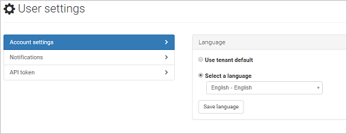
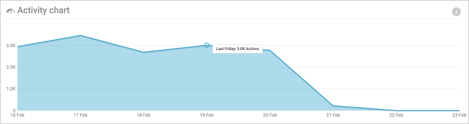

## <a name="managing-admin-access"></a>Administración del acceso de administrador

Cloud App Security admite los siguientes roles de administración:

- Administrador global: los administradores globales tienen **acceso completo**. Los administradores con acceso completo tendrán todos los permisos de Cloud App Security para agregar administradores, incorporar directivas y parámetros de configuración, cargar registros y realizar acciones de gobierno.
- Administrador de seguridad: los administradores de seguridad tienen **acceso completo**. Los administradores con acceso completo tendrán todos los permisos de Cloud App Security para agregar administradores, incorporar directivas y parámetros de configuración, cargar registros y realizar acciones de gobierno.
- Lector de seguridad: el lector de seguridad tiene permisos de solo lectura y puede administrar las alertas. El lector de seguridad no puede realizar las siguientes acciones:
      - Crear directivas o editar y cambiar las existentes 
      - Desempeñar acciones de control 
      - Cargar registros de detección
      - Prohibir o aprobar aplicaciones de terceros
      - Obtener acceso a la página de configuración del intervalo de direcciones IP ni verla
      - Obtener acceso a cualquier página de configuración ni verla 
      - Obtener acceso a la configuración de detección ni verla 
      - Obtener acceso a la página de conectores de aplicaciones ni verla
      - Obtener acceso al registro de gobierno ni verlo 
      - Obtener acceso a la página de informes de instantáneas de administración ni verla 

Los administradores con estos roles en Azure Active Directory u Office 365 tendrán los mismos roles de seguridad en Cloud App Security. Para obtener más información, sobre los roles de administrador, consulte [Asignación de roles de administrador en Azure Active Directory](https://docs.microsoft.com/en-us/azure/active-directory/active-directory-assign-admin-roles).

Para agregar administradores adicionales a Cloud App Security:

1. Haga clic en el engranaje de configuración  y luego en **Administrar acceso de administrador**. 

2. Agregue los administradores que deben tener acceso a Cloud App Security.
  
      
3. A continuación, haga clic en la lista desplegable para establecer el tipo de acceso que tendrá el administrador: **Acceso completo** o **Lector de seguridad**.

     >[!NOTE]
      >Si un **Lector de seguridad** intenta obtener acceso a una página restringida o realizar una acción restringida, recibirá un error por el que se notifica que no tiene permiso para obtener acceso a la página o realizar la acción.

4. Haga clic en **Cerrar**.  

   >[!NOTE]
    >Cualquier usuario no invitado (con un rol adecuado, como administrador global, de seguridad o de cumplimiento), puede invitar a otros usuarios a Cloud App Security.
  
   

**Para invalidar los permisos de administrador:**

Si desea invalidar un permiso de administrador de Azure Active Directory o Office 365, puede hacerlo manualmente agregando el usuario a Cloud App Security y asignándole un rol.
Por ejemplo, si desea que Stephanie, una usuaria que tiene el rol de Lector de seguridad en Azure Active Directory, tenga Acceso completo en Cloud App Security, puede agregarla manualmente a Cloud App Security y asignarle Acceso completo a fin de invalidar su rol y concederle los permisos deseados en Cloud App Security. 


##  <a name="Adminsettings"></a> Personalizar la configuración de administración  
Para configurar sus preferencias como un administrador de Cloud App Security, haga clic en su nombre en la barra de menús del portal y seleccione **Configuración de usuario** para establecer lo siguiente:  
  
1.  Haga clic en **Configuración de la cuenta**. Aquí puede personalizar el idioma del portal para verlo según su elección. Se puede establecer para mostrar el portal en el idioma predeterminado o bien en un idioma diferente de su preferencia.  
  
       
  
2.  Haga clic en **Notificaciones** y establezca las preferencias de notificación de texto y correo electrónico para los mensajes recibidos del sistema.  Puede establecer la gravedad de las alertas y las infracciones para las que quiera recibir correos electrónicos. La gravedad se establece por directiva, por lo que cuando se produzcan infracciones, recibirá una notificación de correo según esta configuración y la configuración de gravedad de la directiva que se ha infringido. Los correos se enviarán al alias asociado con la cuenta de usuario de administrador que se ha usado para iniciar sesión en Cloud App Security. Escriba un número de teléfono para permitir que Cloud App Security le envíe mensajes de texto cuando se envíen alertas y notificaciones y establezca el nivel de gravedad a partir del cual quiera recibir notificaciones por mensaje de texto.  
  
   > [!NOTE] 
   > El número máximo de alertas que se enviarán por mensaje de texto es de 10 al día por número de teléfono. Tenga en cuenta que el día se calcula según la zona horaria UTC. 
  
    
  
3. Haga clic en **Guardar** cuando acabe.  


## <a name="region-and-language-settings"></a>Configuración de región e idioma  
  
1. Establezca el **idioma** predeterminado que se usará en el portal. Para cambiar el idioma de un administrador específico, vaya a **Configuración de usuario** > **Configuración de la cuenta**.  
  
     
  
2. Establezca la **zona horaria principal**. Cloud App Security analiza y agrega datos continuamente. La zona horaria del portal de Cloud App Security está establecida en UTC de forma predeterminada. Es importante establecer la zona horaria principal, ya que permite a Cloud App Security fechar con precisión los incidentes en el sistema. Por ejemplo, en el diagrama de actividad, los datos se organizan por fecha, y estas fechas se ven afectadas por la zona horaria del sistema, por lo que si no ha modificado la zona horaria predeterminada, los datos se organizarán en días de 24 horas según la zona horaria UTC, lo que puede sesgar los datos por muchas horas.  
  
       
  
## <a name="back-up-portal-settings"></a>Copia de seguridad de la configuración del portal

Si, en un momento determinado, quiere hacer una copia de seguridad de la configuración del portal, puede hacerlo en esta pantalla. Haga clic en Exportar configuración del portal para crear un archivo .json con todas las opciones de configuración del portal, incluidas las reglas de directivas, los grupos de usuarios y los intervalos de direcciones IP.  
  
  
  
##  <a name="mailsettings"></a>Personalizar la experiencia  
En la barra de menús, haga clic en el icono de configuración  y seleccione **Configuración de correo** para establecer los parámetros de las notificaciones de correo enviadas desde Cloud App Security a los administradores que solicitan alertas, así como de las notificaciones enviadas a los usuarios finales sobre infracciones en las que puedan haber participado.  
  
  
  
Configura lo siguiente:  
  
1.  **Dirección de correo electrónico del campo Desde**: cuenta de correo que quiere usar para enviar la notificación.  
  
     **Nombre para mostrar del campo Desde**: nombre que quiere que aparezca en el campo **Desde** del mensaje de correo.  
  
     **Dirección de correo electrónico del campo Responder a**: cuenta de correo que se usará para las respuestas al mensaje.  
  
       
  
2.  Puede usar un archivo .html para personalizar y diseñar los mensajes de correo enviados desde el sistema. El archivo .html que use como plantilla debe incluir lo siguiente:  
  
    -   Todas las CSS de plantilla deben estar alineadas en la plantilla.  
  
    -   La plantilla debe tener tres marcadores de posición no modificables:  
  
         %%logo%%: dirección URL que lleva al logotipo de la empresa que se ha cargado en la página de configuración General.  
  
         %%title%%: marcador de posición del título del correo electrónico, según lo establecido por la directiva.  
  
         %%content%%: marcador de posición del contenido que se incluirá para los usuarios finales, según lo establecido por la directiva.  
  
     Esta es una plantilla de correo de ejemplo: 
```html
<!DOCTYPE html PUBLIC "-//W3C//DTD XHTML 1.0 Transitional//EN" "http://www.w3.org/TR/xhtml1/DTD/xhtml1-transitional.dtd">
  <html>  
       <head>  
            <meta http-equiv="Content-Type" content="text/html; charset=UTF-8"/>  
            <meta name="viewport" content="width=device-width, initial-scale=1.0"/>  
          </head>  
          <body class="end-user">  
          <table border="0" cellpadding="20%" cellspacing="0" width="100%" id="background-table">  
            <tr>  
              <td align="center">  
                <!--[if (gte mso 9)|(IE)]>  
                <table width="600" align="center" cellpadding="0" cellspacing="0" border="0">  
                  <tr>  
                    <td>  
                <![endif]-->  
                <table bgcolor="#ffffff" align="center" border="0" cellpadding="0" cellspacing="0" style="padding-bottom: 40px;" id="container-table">  
                  <tr>  
                    <td align="right" id="header-table-cell">  
                        
                    </td>  
                  </tr>  
                  <tr>  
                    <td style="padding-top: 58px;" align="center" valign="top">  
                      <table width="100%" cellpadding="12">  
                        <tr>  
                          <td align="center" class="round-title">  
                            %%title%%  
                          </td>  
                        </tr>  
                      </table>  
                    </td>  
                  </tr>  
                  <tr>  
                    <td style="padding: 0 40px 79px 40px;" class="content-table-cell" align="left" valign="top">  
                        %%content%%  
                    </td>  
                  </tr>  
                  <tr>  
                    <td class="last-row"></td>  
                  </tr>  
                </table>  
                <!--[if (gte mso 9)|(IE)]>  
                </td>  
                </tr>  
                </table>  
                  <![endif]-->  
              </td>  
              </tr>  
          </table>  
            </body>  
          </html>  
    ```

  
3.  Click **Upload a template...** and select the file you created.  
  
     Then, click **Send a test email** to send yourself a test email to see an example of the template you created.  
     The email will be sent to the account you used to log into the portal. In the test email you will be able to see the metadata fields, the template, the email subject, the title in the email body and the content.  
  
## Single sign-on  
Cloud App Security is coupled with Azure Active Directory for authentication, provisioning, and licensing related activities. For information on how to manage single sign-on, see [Azure Active Directory federation compatibility list: third-party identity providers that can be used to implement single sign-on](https://msdn.microsoft.com/library/azure/jj679342.aspx).  


> [!NOTE] 
> If you use ExpressRoute, Cloud App Security is deployed in Azure and fully integrated with [ExpressRoute](https://azure.microsoft.com/documentation/articles/expressroute-introduction/). All interactions with the Cloud App Security apps and traffic sent to Cloud App Security, including upload of discovery logs, is routed via ExpressRoute **public peering** for improved latency, performance and security. There are no configuration steps required from the customer side.  
    For more information about  Public Peering, see [ExpressRoute circuits and routing domains](https://azure.microsoft.com/documentation/articles/expressroute-circuit-peerings/).  
    
## See Also  
[Set up Cloud Discovery](set-up-cloud-discovery.md)   
[For technical support, please visit the Cloud App Security assisted support page.](http://support.microsoft.com/oas/default.aspx?prid=16031)   
[Premier customers can also choose Cloud App Security directly from the Premier Portal.](https://premier.microsoft.com/)  
  
  