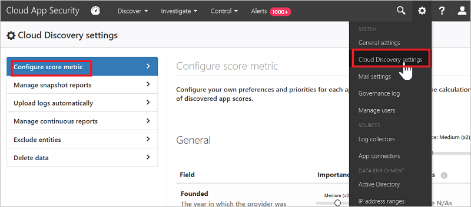

# Trabajar con la puntuación de riesgo de la aplicación

*Se aplica a: Microsoft Cloud App Security*

El Catálogo de aplicaciones en la nube proporciona una imagen completa de todo lo que puede identificar Cloud Discovery. Cloud Discovery analiza los registros de tráfico en el catálogo de aplicaciones en la nube de Microsoft Cloud App Security de más de 16 000 aplicaciones en la nube. Las aplicaciones se clasifican y puntuan en función de más de 80 factores de riesgo para proporcionar visibilidad continua del uso de la nube, Shadow IT y el riesgo que Shadow IT supone para su organización. En este artículo se proporcionan instrucciones sobre cómo usar y personalizar la puntuación de riesgo de la aplicación de Cloud App Security.

## El Catálogo de aplicaciones en la nube

El **catálogo de aplicaciones en la nube** evalúa el riesgo de las aplicaciones en la nube en función de certificaciones normativas, estándares del sector y procedimientos recomendados. En el catálogo de aplicaciones en la nube se ejecutan cuatro procesos complementarios para mantenerlo actualizado:

1. Extracción de datos automatizada directamente desde la aplicación en la nube. La extracción es para atributos como el cumplimiento de SOC 2, los términos de servicio, la dirección URL de inicio de sesión, la Directiva de privacidad y la ubicación de HQ.
2. Extracción de datos automatizada avanzada mediante algoritmos de Cloud App Security (para atributos como encabezados de seguridad HTTP).
3. Análisis continuo por parte del equipo de analistas de la nube de Cloud App Security (para atributos como el cifrado en reposo).
4. Solicitudes de revisión de los clientes, según las solicitudes de envío de clientes para realizar cambios en el catálogo de aplicaciones en la nube. Todas las solicitudes se someten al examen del equipo de analistas de la nube y se actualizan en función de sus conclusiones.

Cada vez es mayor la demanda de aplicaciones en la nube por parte de las unidades de negocio, como solución para sus necesidades en constante evolución. El catálogo de aplicaciones de nube le permite elegir con criterio qué aplicaciones se ajustan a los requisitos de seguridad de la organización. El catálogo le mantiene al día con los estándares de seguridad más recientes, las vulnerabilidades y las infracciones.

Por ejemplo, supongamos que quiere comparar las aplicaciones CRM y asegurarse de que están protegidas adecuadamente. Puede usar la página Catálogo de aplicaciones en la nube para filtrar las aplicaciones que quiera:

1. En la página **Catálogo de aplicaciones de nube**, seleccione **CRM** en **Examinar por categoría**.
2. Use los filtros **avanzados** y establezca **Factor de riesgo de cumplimiento** para **SOC 2** igual a **True**.
3. Establezca **Factor de riesgo de cumplimiento de normas** para **ISO 27001** igual a **True**.
4. Establezca el **Factor de riesgo para la seguridad** para **Data at rest encryption** (Cifrado de datos en reposo) igual a **No admitido** y **No disponible**.
5. Establezca **Factor de riesgo de seguridad** para **Pista de auditoría de administración** igual a **True**.
6. Seleccione **Factor de riesgo de seguridad** para **Pista de auditoría de usuario** igual a **True**.

Una vez que se hayan filtrado los resultados, puede revisar las aplicaciones correspondientes y buscar la que mejor se adapte a sus necesidades.

## Filtros del Catálogo de aplicaciones en la nube

Hay filtros básicos y avanzados en el Catálogo de aplicaciones en la nube. Para crear un filtro complejo, use la opción avanzada, que incluye los siguientes filtros:

- **Etiquetas de aplicación**: las etiquetas le permiten personalizar el Catálogo de aplicaciones en la nube. Puede seleccionar la etiqueta **Autorizada** o **No autorizada**, o bien crear etiquetas personalizadas para las aplicaciones. Después, estas etiquetas pueden usarse como filtros. Los filtros son útiles para profundizar un poco más en los tipos de aplicaciones específicos que quiere investigar.
- **Aplicaciones y dominios**: permite buscar aplicaciones específicas o aplicaciones usadas en dominios concretos.
- **Categorías**: el filtro de categorías, que se encuentra a la izquierda de la página, permite buscar tipos de aplicaciones en función de categorías de aplicaciones. Por ejemplo, aplicaciones de redes sociales, aplicaciones de almacenamiento en la nube y más tipos de aplicaciones. Puede seleccionar más de una categoría a la vez o una única categoría. Después, aplique los filtros básicos o avanzados sobre las categorías.
- **Factor de riesgo de cumplimiento**: permite buscar normas, certificaciones y elementos de conformidad específicos que puede cumplir la aplicación. Por ejemplo, HIPAA, ISO 27001, SOC 2 y PCI-DSS.
- **Factor de riesgo general**: permite buscar factores de riesgo generales, como la popularidad entre los consumidores, la configuración regional del centro de datos y muchos más.
- **Factor de riesgo legal**: permite filtrar en función de las regulaciones y directivas en vigor. Usar factores de riesgo legal ayuda a garantizar la protección y la privacidad de los datos de los usuarios de la aplicación, como RGPD, DMCA y directivas de retención de datos.
- **Puntuación de riesgo**: permite filtrar las aplicaciones mediante una puntuación de riesgo en la que puede centrarse. Por ejemplo, revisar solo las aplicaciones de riesgo.
- **Factor de riesgo para la seguridad**: permite filtrar en función de medidas de seguridad específicas. Las medidas incluyen entre otras el cifrado en reposo y la autenticación multifactor.

## Sugerir un cambio

Si encuentra una nueva aplicación en el entorno que Cloud App Security todavía no ha puntuado puede solicitar una revisión de la aplicación. También puede solicitar una revisión de un nuevo factor de riesgo, una actualización de puntuación o datos de la aplicación que no están actualizados.

**Para sugerir una nueva aplicación:**

1. En la parte superior de la página **Aplicaciones detectadas**, haga clic en los tres puntos y seleccione **Sugerir nueva aplicación**.

    

2. En el elemento emergente **sugerir nueva aplicación** en la nube, rellene los detalles sobre la nueva aplicación. Incluya el nombre y el dominio de la aplicación.

    

3. Se recomienda activar la casilla para permitir que los analistas de Cloud App Security se pongan en contacto con usted en caso de que necesiten más información sobre la aplicación. Rellenar la información de contacto también le permitirá recibir actualizaciones cuando se complete el análisis.

**Para actualizar un factor de riesgo, puntuación o datos de la aplicación:**

1. En la página **Catálogo de aplicaciones en la nube**, en la fila de la aplicación que quiere actualizar, haga clic en los tres puntos que aparecen al final de la fila y seleccione **Solicitar actualización de puntuación**.

    

2. En el elemento emergente **sugerir una mejora** , seleccione si desea solicitar una actualización de puntuación, sugerir un nuevo factor de riesgo o actualizar los datos de la aplicación.

    

3. Se recomienda activar la casilla para permitir que los analistas de Cloud App Security se pongan en contacto con usted en caso de que necesiten más información sobre la aplicación. Rellenar la información de contacto también le permitirá recibir actualizaciones cuando se complete el análisis.

## Personalización de la puntuación de riesgo

Cloud Discovery proporciona datos importantes sobre la credibilidad y la confianza de las aplicaciones en la nube que se usan en el entorno. En el portal, cada aplicación detectada se muestra junto con una puntuación total. La puntuación representa la evaluación de Cloud App Security de la madurez de uso para las empresas de esta aplicación en concreto. La puntuación total de cualquier aplicación es un promedio ponderado de tres subpuntuaciones relacionadas con las tres subcategorías que Cloud App Security tiene en cuenta al evaluar la confiabilidad:

- **General** : esta categoría se refiere a los hechos básicos sobre la empresa que produce la aplicación, incluidos su dominio, año de Fundación y popularidad. Estos campos están diseñados para reflejar la estabilidad de la empresa en el nivel más básico.

- **Seguridad**: la categoría de seguridad tiene en cuenta todos los estándares relacionados con la seguridad física de los datos usados por la aplicación detectada. Esta categoría incluye campos tales como autenticación multifactor, cifrado, clasificación de los datos y propiedad de los datos.

- **Cumplimiento normativo**: esta categoría muestra qué estándares comunes de cumplimiento de procedimientos recomendados cumple la empresa que produce la aplicación. La lista de especificaciones incluye estándares tales como HIPAA, CSA y PCI-DSS.

- **Factor de riesgo legal**: permite filtrar en función de las regulaciones y directivas en vigor para garantizar la protección y la privacidad de los datos de los usuarios de la aplicación, por ejemplo, el RGPD, el DMCA y la directiva de retención de datos.

Cada una de las categorías se compone de muchas propiedades específicas. Según el algoritmo de puntuación de Cloud App Security, cada propiedad recibe una puntuación preliminar de entre 0 y 10, en función del valor. Los valores True y False recibirán 10 o 0 en consecuencia. Pero las propiedades continuas como la antigüedad del dominio recibirán un valor determinado del espectro. La puntuación de cada propiedad se pondera con todos los demás campos existentes en la categoría para crear la subpuntuación de esta. Si encuentra una aplicación sin puntuar, eso normalmente indica que sus propiedades son desconocidas y que, por lo tanto, no se ha puntuado.

Es importante dedicar un minuto a revisar y modificar las ponderaciones predeterminadas otorgadas a la configuración de puntuación de Cloud Discovery. De forma predeterminada, todos los distintos parámetros evaluados reciben el mismo peso. Si hay determinados parámetros que son más o menos importantes para la organización, es importante cambiarlos de la siguiente forma:

1. En el portal, en el icono de configuración, seleccione **Configuración de Cloud Discovery**.

2. En **Métrica de puntuación**, deslice el valor **Importancia** para cambiar la ponderación del campo o la categoría de riesgo. La importancia se puede establecer en **Omitida**, **Baja**, **Media**, **Alta** o **Muy alta**.

3. Además, puede establecer si determinados valores no están disponibles o no son aplicables en el cálculo de la puntuación. Cuando se incluyen, los valores no aplicables tienen una contribución negativa a la puntuación calculada.

    

Toda la información necesaria para entender cómo se apilan nuestras puntuaciones de riesgo de Cloud App Security está disponible en el portal de Cloud App Security. Para comprender mejor el peso de un factor de riesgo en una categoría de riesgo específica, use el botón "i" a la derecha de cada nombre de campo en el perfil de la aplicación. Esto proporciona información sobre cómo Cloud App Security puntúa exactamente un factor de riesgo específico. La puntuación es el valor del factor de riesgo en una escala de 1 a 10 + su peso en la categoría de riesgo:

Para comprender el peso de una categoría de riesgo en la puntuación total de una aplicación, mantenga el mouse sobre la puntuación de la categoría de riesgo:

## Reemplazar la puntuación de riesgo

Para reemplazar la puntuación de riesgo, en la tabla **Aplicaciones detectadas** o en el **Catálogo de aplicaciones en la nube**, haga clic en los tres puntos que aparecen a la derecha de cualquier aplicación y seleccione **Override app score** (Reemplazar la puntuación de la aplicación).
Puede reemplazar la puntuación de riesgo de una aplicación sin cambiar la forma en que se pondera, para obtener resultados inmediatos para la organización. Por ejemplo, la puntuación de riesgo de una aplicación LOB que usa es 8. Pero la aplicación está autorizada y apoyada por la organización. Es posible que quiera cambiar la puntuación de riesgo a 10 para la aplicación LOB.

Después de actualizar la puntuación, puede incluir notas en la aplicación en las que explique a los demás administradores las razones empresariales por las que ha modificado la puntuación de la aplicación.

También puede agregar notas para que el motivo de este cambio le quede claro a los usuarios que revisen la aplicación.

## Pasos siguientes

> [!div class="nextstepaction"]
> [Actividades diarias para proteger el entorno de nube](daily-activities-to-protect-your-cloud-environment.md)

[!INCLUDE [Open support ticket](includes/support.md)]
