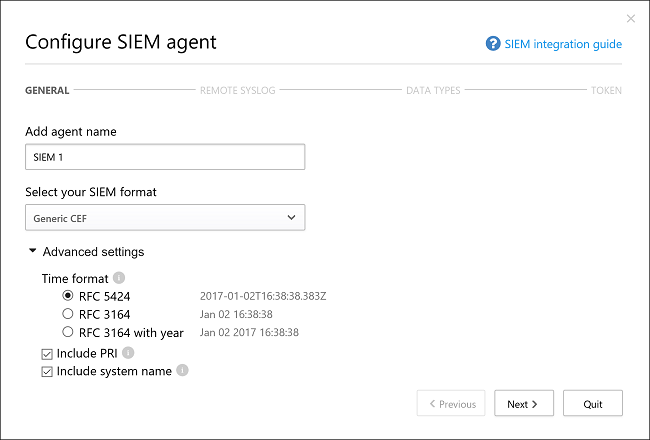

# <a name="siem-integration"></a>Integración de SIEM
    
Ahora puede integrar Cloud App Security con su servidor SIEM para habilitar la supervisión centralizada de alertas y actividades de Office 365. A medida que Office 365 admita nuevos eventos y actividades, podrá supervisarlos en Cloud App Security. La integración de un servicio SIEM le permite proteger mejor sus aplicaciones de nube a la vez que mantiene el flujo de trabajo de seguridad habitual, automatizando así los procedimientos de seguridad y estableciendo correlaciones entre eventos basados en la nube y eventos locales. El agente SIEM de Cloud App Security se ejecuta en el servidor y extrae las alertas y las actividades de Cloud App Security y las transmite al servidor SIEM.

Cuando integre por primera vez su SIEM con Cloud App Security, las actividades y las alertas de los dos últimos días se reenviarán al SIEM, así como todas las actividades y alertas (en función del filtro seleccionado) que se produzcan a partir de entonces. Además, si deshabilita esta característica durante un período prolongado, cuando la habilite de nuevo, se reenviarán las alertas y las actividades de los dos últimos días, así como las que se produzcan a partir de entonces.

## <a name="siem-integration-architecture"></a>Arquitectura de integración de SIEM

El agente SIEM se implementa en la red de su organización. Una vez implementado y configurado, extrae los tipos de datos que se han configurado (alertas y actividades) mediante las API de RESTful de Cloud App Security.
El tráfico se envía a través de un canal HTTPS cifrado en el puerto 443.

Cuando el agente SIEM recupera los datos de Cloud App Security, envía mensajes de Syslog al SIEM local mediante la configuración de red proporcionada durante la instalación (TCP o UDP con un puerto personalizado). 


## <a name="supported-siems"></a>SIEM admitidos

Cloud App Security actualmente admite HP ArchSight y CEF genérico.

## <a name="how-to-integrate"></a>Integración

La integración con SIEM se realiza en tres pasos:
1. Configuración en el portal de Cloud App Security 
2. Descarga del archivo JAR y ejecución en el servidor
3. Valide que el agente SIEM funcione.

### <a name="prerequisites"></a>Requisitos previos

- Servidor Windows o Linux estándar (puede ser una máquina virtual).
- El servidor debe ejecutar Java 8; no se admiten versiones anteriores.

## <a name="integrating-with-your-siem"></a>Integración con su SIEM

### <a name="step-1-set-it-up-in-the-cloud-app-security-portal"></a>Paso 1: configuración en el portal de Cloud App Security

1. En el portal de Cloud App Security, en el engranaje de configuración, haga clic en **Extensiones de seguridad** y en la pestaña **Agentes SIEM**.

2. Haga clic en el icono de signo más para iniciar el asistente **Agregar agente SIEM**.
3. En el asistente, haga clic en **Add SIEM agent** (Agregar agente SIEM). 
4. En el asistente, asigne un nombre, **seleccione el formato SIEM** y establezca la **Configuración avanzada** que esté relacionada con ese formato. Haga clic en **Siguiente**.

   

5. Escriba la dirección IP o nombre de host del **host de syslog remoto** y el **número de puerto de syslog**. Seleccione TCP o UDP como protocolo de syslog remoto.
Puede trabajar con el administrador de seguridad para obtener estos detalles si no los tiene.
Haga clic en **Siguiente**.

  

6. Seleccione los tipos de datos, **Alertas** y **Actividades** que quiera exportar al servidor SIEM. Use el control deslizante para habilitarlas y deshabilitarlas; de forma predeterminada todo está seleccionado. Puede usar el menú desplegable **Apply to** (Aplicar a) para establecer filtros para enviar solo alertas y actividades específicas al servidor SIEM.
Puede hacer clic en **Editar y obtener vista previa de resultados** para comprobar que el filtro funciona según lo esperado. Haga clic en **Siguiente**. 

  

7. Copie el token y guárdelo para más adelante. Después de hacer clic en Finalizar y salir del asistente, en la página SIEM, en la tabla podrá ver al agente SIEM que ha agregado. Mostrará que está **Creado** hasta que se conecte más adelante.

### <a name="step-2-download-the-jar-file-and-run-it-on-your-server"></a>Paso 2: descarga del archivo JAR y ejecución en el servidor

1. En [Centro de descarga de Microsoft](https://go.microsoft.com/fwlink/?linkid=838596), después de aceptar los [términos de licencia del software](https://go.microsoft.com/fwlink/?linkid=862491), descargue el archivo .zip y descomprímalo.

2. Extraiga el archivo .jar desde el archivo .zip y ejecútelo en el servidor.
 Después de ejecutar el archivo, ejecute lo siguiente:
    
        java -jar mcas-siemagent-0.87.20-signed.jar [--logsDirectory DIRNAME] [--proxy ADDRESS[:PORT]] --token TOKEN

> [!NOTE]
> - El nombre de archivo puede diferir dependiendo de la versión del agente SIEM.
> - Los parámetros entre corchetes [  ] son opcionales y solo deben usarse si procede.
> - Se recomienda ejecutar el archivo JAR mientras el servidor se inicia.
>   - Windows: ejecute como una tarea programada y asegúrese de haber configurado la tarea como **Ejecutar tanto si un usuario inició sesión como si no** y de haber desactivado la casilla **Detener la tarea si se ejecuta durante más de**.
>   - Linux: agregue el comando run con un símbolo **&** al archivo rc.local. Por ejemplo: `java -jar mcas-siemagent-0.87.20-signed.jar [--logsDirectory DIRNAME] [--proxy ADDRESS[:PORT]] --token TOKEN &`

Se usan las variables siguientes:
- NOMBRE_DIRECTORIO es la ruta de acceso al directorio que quiere usar para los registros de depuración del agente local.
- DIRECCIÓN[:PUERTO] es la dirección del servidor proxy y el puerto que usa el servidor para conectarse a Internet.
- TOKEN es el token del agente SIEM que ha copiado en el paso anterior.

Puede escribir -h en cualquier momento para obtener ayuda.

Estos son registros de actividad de ejemplo que se envían al servidor SIEM:
```
    2017-07-11T19:14:55.895Z CEF:0|MCAS|SIEM_Agent|0.102.17|EVENT_CATEGORY_LOGIN|Log on|0|externalId=1499800495894_e453bc33-a7c1-48f7-8397-8ae8e2758183 start=1499800495895 end=1499800495895 msg=Log on suser=admin@contoso.com destinationServiceName=Microsoft Exchange Online dvc=13.82.149.151 requestClientApplication=Mozilla/5.0 (Windows NT 10.0; Win64; x64) AppleWebKit/537.36 (KHTML, like Gecko) Chrome/59.0.3071.115 Safari/537.36 machine_id_149980022970038514 cs1Label=portalURL cs1=https://cloud-app-security.com/#/audits?activity.id\=eq(1499800495894_e453bc33-a7c1-48f7-8397-8ae8e2758183,) cs2Label=uniqueServiceAppIds cs2=APPID_OUTLOOK cs3Label=targetObjects cs3=admin@contoso.com c6a1Label="Device IPv6 Address" c6a1=
    2017-07-11T19:14:56.781Z CEF:0|MCAS|SIEM_Agent|0.102.17|EVENT_CATEGORY_DOWNLOAD_FILE|Download file|0|externalId=1499800496781_2e50118e-dee7-40d7-b912-b81a10feed28 start=1499800496781 end=1499800496781 msg=Download file: file name50280117yyct6t.xlsx suser=roy@adallom.com.test destinationServiceName=Salesforce dvc=13.82.149.151 requestClientApplication=Mozilla/5.0 (Windows NT 10.0; Win64; x64) AppleWebKit/537.36 (KHTML, like Gecko) Chrome/59.0.3071.115 Safari/537.36 machine_id_149979855250880034 cs1Label=portalURL cs1=https://cloud-app-security/#/audits?activity.id\=eq(1499800496781_2e50118e-dee7-40d7-b912-b81a10feed28,) cs2Label=uniqueServiceAppIds cs2=APPID_SALESFORCE cs3Label=targetObjects cs3=name50280117yyct6t.xlsx c6a1Label="Device IPv6 Address" c6a1=
    2017-07-11T19:16:04.666Z CEF:0|MCAS|SIEM_Agent|0.102.17|EVENT_CATEGORY_SSO_LOGIN|Single sign-on log on|0|externalId=1499800564666_06496600-edde-4d81-a995-7632e70fb24f start=1499800564666 end=1499800564666 msg=Single sign-on log on suser=admin@contoso.com destinationServiceName=Microsoft Online Services dvc=13.82.149.151 requestClientApplication=Mozilla/5.0 (Windows NT 10.0; Win64; x64) AppleWebKit/537.36 (KHTML, like Gecko) Chrome/59.0.3071.115 Safari/537.36 machine_id_149980039637481908 cs1Label=portalURL cs1=https://cloud-app-security.com/#/audits?activity.id\=eq(1499800564666_06496600-edde-4d81-a995-7632e70fb24f,) cs2Label=uniqueServiceAppIds cs2=APPID_11394 cs3Label=targetObjects cs3=admin@contoso.com c6a1Label="Device IPv6 Address" c6a1=
    2017-07-12T13:28:29.067Z CEF:0|MCAS|SIEM_Agent|0.102.17|EVENT_CATEGORY_DOWNLOAD_FILE|Download file|0|externalId=1499866109067_8e3fae2c-ca5b-4163-84b6-fb9a03c4d052 start=1499866109067 end=1499866109067 msg=Download file: file CC004.txt suser=admin@box-contoso.com destinationServiceName=Box dvc=194.69.102.134 requestClientApplication=Mozilla/5.0 (Linux; Android 7.0; SAMSUNG SM-G930F Build/NRD90M) AppleWebKit/537.36 (KHTML, like Gecko) SamsungBrowser/5.0 Chrome/51.0.2704.106 Mobile Safari/537.36 cs1Label=portalURL cs1=https://cloud-app-security.com/#/audits?activity.id\=eq(1499866109067_8e3fae2c-ca5b-4163-84b6-fb9a03c4d052,) cs2Label=uniqueServiceAppIds cs2=APPID_BOX cs3Label=targetObjects cs3=CC004.txt c6a1Label="Device IPv6 Address" c6a1=
    2017-07-12T14:15:33.901Z CEF:0|MCAS|SIEM_Agent|0.102.17|EVENT_CATEGORY_UPLOAD_FILE|Upload file|0|externalId=1499868933901_72c21ebe-c206-4d8c-a41b-224035868d09 start=1499868933901 end=1499868933901 msg=Upload file: file response.txt suser=user1@test15-adallom.com destinationServiceName=Google Drive dvc=194.69.102.134 requestClientApplication=Mozilla/5.0 (Windows NT 10.0; WOW64; Trident/7.0; Touch; rv:11.0) like Gecko cs1Label=portalURL cs1=https://cloud-app-security.com/#/audits?activity.id\=eq(1499868933901_72c21ebe-c206-4d8c-a41b-224035868d09,) cs2Label=uniqueServiceAppIds cs2=APPID_26069 cs3Label=targetObjects cs3=response.txt c6a1Label="Device IPv6 Address" c6a1=
    2017-07-12T18:53:16.519Z CEF:0|MCAS|SIEM_Agent|0.102.17|EVENT_CATEGORY_LOGIN|Log on|0|externalId=1499885596519_ed261269-9b07-4418-9ded-8cad464d677f start=1499885596519 end=1499885596519 msg=Log on suser=admin@contoso.com destinationServiceName=Office 365 dvc=13.82.149.151 requestClientApplication=Mozilla/5.0 (Windows NT 10.0; Win64; x64) AppleWebKit/537.36 (KHTML, like Gecko) Chrome/59.0.3071.115 Safari/537.36 machine_id_149988543613557447 cs1Label=portalURL cs1=https://cloud-app-security.com/#/audits?activity.id\=eq(1499885596519_ed261269-9b07-4418-9ded-8cad464d677f,) cs2Label=uniqueServiceAppIds cs2=APPID_O365 cs3Label=targetObjects cs3=admin@contoso.com c6a1Label="Device IPv6 Address" c6a1=
```
Este es un ejemplo de archivo de registro de alertas:
```
  2017-07-15T20:42:30.531Z CEF:0|MCAS|SIEM_Agent|0.102.17|ALERT_CABINET_EVENT_MATCH_AUDIT|myPolicy|3|externalId=596a7e360c204203a335a3fb start=1500151350531 end=1500151350531 msg=Activity policy ''myPolicy'' was triggered by ''admin@box-contoso.com'' suser=admin@box-contoso.com destinationServiceName=Box cn1Label=riskScore cn1= cs1Label=portalURL cs1=https://cloud-app-security.com/#/alerts/596a7e360c204203a335a3fb cs2Label=uniqueServiceAppIds cs2=APPID_BOX cs3Label=relatedAudits cs3=1500151288183_acc891bf-33e1-424b-a021-0d4370789660
  2017-07-16T09:36:26.550Z CEF:0|MCAS|SIEM_Agent|0.102.17|ALERT_CABINET_EVENT_MATCH_AUDIT|test-activity-policy|3|externalId=596b339b0c204203a33a51ae start=1500197786550 end=1500197786550 msg=Activity policy ''test-activity-policy'' was triggered by ''user@contoso.com'' suser=user@contoso.com destinationServiceName=Salesforce cn1Label=riskScore cn1= cs1Label=portalURL cs1=https://cloud-app-security.com/#/alerts/596b339b0c204203a33a51ae cs2Label=uniqueServiceAppIds cs2=APPID_SALESFORCE cs3Label=relatedAudits cs3=1500197720691_b7f6317c-b8de-476a-bc8f-dfa570e00349
  2017-07-16T09:17:03.361Z CEF:0|MCAS|SIEM_Agent|0.102.17|ALERT_CABINET_EVENT_MATCH_AUDIT|test-activity-policy3|3|externalId=596b2fd70c204203a33a3eeb start=1500196623361 end=1500196623361 msg=Activity policy ''test-activity-policy3'' was triggered by ''admin@contoso.com'' suser=admin@contoso.com destinationServiceName=Office 365 cn1Label=riskScore cn1= cs1Label=portalURL cs1=https://cloud-app-security.com/#/alerts/596b2fd70c204203a33a3eeb cs2Label=uniqueServiceAppIds cs2=APPID_O365 cs3Label=relatedAudits cs3=1500196549157_a0e01f8a-e29a-43ae-8599-783c1c11597d
  2017-07-16T09:17:15.426Z CEF:0|MCAS|SIEM_Agent|0.102.17|ALERT_CABINET_EVENT_MATCH_AUDIT|test-activity-policy|3|externalId=596b2fd70c204203a33a3eec start=1500196635426 end=1500196635426 msg=Activity policy ''test-activity-policy'' was triggered by ''admin@contoso.com'' suser=admin@contoso.com destinationServiceName=Microsoft Office 365 admin center cn1Label=riskScore cn1= cs1Label=portalURL cs1=https://cloud-app-security.com/#/alerts/596b2fd70c204203a33a3eec cs2Label=uniqueServiceAppIds cs2=APPID_O365_PORTAL cs3Label=relatedAudits cs3=1500196557398_3e102b20-d9fa-4f66-b550-8c7a403bb4d8
  2017-07-16T09:17:46.290Z CEF:0|MCAS|SIEM_Agent|0.102.17|ALERT_CABINET_EVENT_MATCH_AUDIT|test-activity-policy4|3|externalId=596b30200c204203a33a4765 start=1500196666290 end=1500196666290 msg=Activity policy ''test-activity-policy4'' was triggered by ''admin@contoso.com'' suser=admin@contoso.com destinationServiceName=Microsoft Exchange Online cn1Label=riskScore cn1= cs1Label=portalURL cs1=https://cloud-app-security.com/#/alerts/596b30200c204203a33a4765 cs2Label=uniqueServiceAppIds cs2=APPID_OUTLOOK cs3Label=relatedAudits cs3=1500196587034_a8673602-7e95-46d6-a1fe-c156c4709c5d
  2017-07-16T09:41:04.369Z CEF:0|MCAS|SIEM_Agent|0.102.17|ALERT_CABINET_EVENT_MATCH_AUDIT|test-activity-policy2|3|externalId=596b34b10c204203a33a5240 start=1500198064369 end=1500198064369 msg=Activity policy ''test-activity-policy2'' was triggered by ''user2@test15-adallom.com'' suser=user2@test15-adallom.com destinationServiceName=Google cn1Label=riskScore cn1= cs1Label=portalURL cs1=https://cloud-app-security.com/#/alerts/596b34b10c204203a33a5240 cs2Label=uniqueServiceAppIds cs2=APPID_33626 cs3Label=relatedAudits cs3=1500197996117_fd71f265-1e46-4f04-b372-2e32ec874cd3
```

### <a name="step-3-validate-that-the-siem-agent-is-working"></a>Paso 3: validación del correcto funcionamiento del agente SIEM

1. Asegúrese de que el estado del agente SIEM en el portal de Cloud App Security no sea **Error de conexión** o **Desconectado** y de que no haya ninguna notificación del agente. Verá **Error de conexión** si la conexión está inactiva durante más de dos horas y **Desconectado** si la conexión está inactiva durante más de 12 horas.
 
 
   En su lugar, el estado debe ser Conectado, tal como se muestra aquí: .

2. En el servidor Syslog o SIEM, asegúrese de que vea las alertas y actividades procedentes de Cloud App Security.


## <a name="regenerating-your-token"></a>Volver a generar el token
Si pierde el token, siempre puede volver a generarlo haciendo clic en los tres puntos al final de la fila del agente SIEM de la tabla y seleccionando **Regenerar token**.

 

## <a name="editing-your-siem-agent"></a>Editar el agente SIEM 
Si necesita editar el agente SIEM en el futuro, puede hacer clic en los tres puntos al final de la fila del agente SIEM de la tabla y seleccionar **Editar**. Si edita el agente SIEM, no es necesario volver a ejecutar el archivo .jar, ya que se actualiza automáticamente.


## <a name="deleting-your-siem-agent"></a>Eliminación al agente SIEM
Si necesita eliminar el agente SIEM en el futuro, puede hacer clic en los tres puntos al final de la fila del agente SIEM de la tabla y seleccionar **Eliminar**.


> [!NOTE]
> Esta característica está en versión preliminar pública.

## <a name="high-availability-options"></a>Opciones de alta disponibilidad

El agente SIEM es un punto de conexión que permite recuperar hasta dos días de tiempo de inactividad. Se puede conseguir una medida adicional de alta disponibilidad al tener un equilibrador de carga como el punto de conexión del cliente.

## <a name="see-also"></a>Consulte también  
[Solución de problemas de integración de SIEM](troubleshooting-siem.md)   
[Para obtener soporte técnico, visite la página de soporte técnico asistido de Cloud App Security.](http://support.microsoft.com/oas/default.aspx?prid=16031)   
[Los clientes Premier también pueden elegir Cloud App Security directamente desde el Portal Premier.](https://premier.microsoft.com/)  
  
  