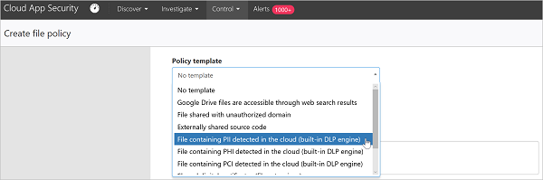
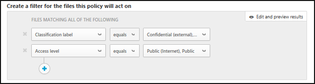

# Control y protección de los archivos  

En el mundo empresarial de hoy en día, donde hay muchos datos e infinidad de dispositivos, puede resultar difícil realizar un seguimiento de dónde se encuentran los datos y quién tiene acceso a ellos. Cloud App Security le permite asumir el control de los datos habilitando la protección de archivos en la nube. Cloud App Security proporciona herramientas para crear directivas para aquello que desea permitir y no permitir en la nube corporativa, y le ofrece una amplia gama de procesos automatizados para proporcionar análisis continuos de conformidad, tareas de eDiscovery legales, DLP para contenido confidencial almacenado en la nube o compartido externa o públicamente y muchos más casos de uso.  
Cloud App Security puede supervisar cualquier tipo de archivo basado en más de 20 filtros de metadatos (por ejemplo, nivel de acceso o tipo de archivo). Para más información, consulte [Archivos](file-filters.md). A continuación figuran dos ejemplos de amenazas relacionadas con datos a las que todas las organizaciones se enfrentan, con procedimientos sobre cómo proteger los archivos en la nube.
 
## Los archivos que contienen datos confidenciales se comparten externamente 

Este caso de uso se aplica a Office 365, G Suite, Box, Dropbox y Salesforce.

### LA AMENAZA
Una de las mayores ventajas de la tecnología en la nube es que ofrece la posibilidad de compartir cualquier cosa con todo el mundo. Sin embargo, tales capacidades conllevan una gran responsabilidad y, para garantizar que no se comparta ningún dato confidencial externamente, tiene que saber qué archivos contienen datos confidenciales y con quién se comparten. Con las herramientas proporcionadas en las aplicaciones en la nube, no puede saber lo que contiene una aplicación en la nube ni quién tiene acceso, así que no es consciente de posibles filtraciones de datos.

### LA SOLUCIÓN
Mediante la detección de estos dos parámetros, sensibilidad y nivel de uso compartido, y su combinación es posible identificar estas posibles infracciones. Cloud App Security examina todos los archivos guardados en las aplicaciones en la nube y los clasifica por su nivel de uso compartido de forma automática. Luego se puede configurar una directiva de archivo en Cloud App Security para buscar todos los datos confidenciales guardados en las aplicaciones en la nube. Cuando se detecta un archivo confidencial compartido externamente, se pueden tomar medidas de corrección manuales o configurar Cloud App Security para que lo haga automáticamente. Así se puede eliminar el riesgo de filtración de datos con un solo clic.

#### Requisitos previos

[Conecte](enable-instant-visibility-protection-and-governance-actions-for-your-apps.md) al menos una aplicación en la nube a Cloud App Security.

#### Configuración de la supervisión

1.  Inicie la supervisión de la aplicación mediante la configuración de una directiva que examine los archivos compartidos externamente en busca de contenido confidencial:

    1. En la página **Directivas**, haga clic en [**Crear directiva de archivo**](data-protection-policies.md). 
    

    2. En el campo [**Plantilla de directiva**](policy-template-reference.md), elija **Se detectó un archivo que contiene DCP en la nube (motor DLP integrado)** y haga clic en **Aplicar plantilla**. 
    
    3. Para supervisar el uso compartido inadecuado de estos archivos que contienen información privada, agregue un filtro con el nivel de acceso que está intentando evitar, por ejemplo, **Nivel de acceso es igual a Externo, Público o Público (Internet)**. 
     

2. Investigación de las coincidencias
    
    1. En la página **Directivas**, haga clic en el nombre de directiva para ir a **Informe la directiva** y revise las coincidencias que se activaron para la directiva.

    2. Puede investigar la coincidencia haciendo clic en una coincidencia específica para abrir el cajón de archivos. En el cajón, puede ver las otras directivas con las que este archivo coincidió, el estado del análisis de contenido y, si hace clic en ello, puede ver las coincidencias de contenido; puede hacer clic en el **Colaboradores** para ver la lista de colaboradores y puede ver si hay alguna etiqueta de clasificación en el archivo. También puede echar un vistazo a la **Ruta de acceso** para ver dónde se guarda el archivo para obtener más contexto sobre el propio archivo.
    
    3. Si encuentra falsos positivos, márquelos con una marca de verificación para excluirlos del informe y de las coincidencias en vivo. Puede utilizar la característica de comentarios para hacer saber al equipo de Cloud App Security las mejoras que le gustaría agregar. 

#### Validación de la directiva

1. Cree un nuevo documento de Word con el texto siguiente: 078-05-1120.
2. A continuación, guarde el archivo como *test file.docx* y compártalo con alguien fuera de su dominio o con una dirección URL pública. 
3. Vaya al informe de directiva. Una coincidencia de directiva de archivo debe aparecer en breve. 
4. Puede hacer clic en la coincidencia para ver el contexto del archivo. La propia coincidencia se enmascarará para proteger los datos confidenciales. 

#### Eliminación del riesgo

Una vez validada y perfeccionada la directiva, quite posibles falsos positivos que puedan haber coincidido con la directiva. Luego, haga lo siguiente: 
  1. Puede tomar [acciones de gobierno](governance-actions.md) inmediatas haciendo clic en los tres puntos situados al final de la fila y seleccionando la acción de gobierno relevante, por ejemplo, **Poner en cuarentena de usuario**.

 

   2. Después de que se valide por completo, puede establecerla para realizar acciones de gobierno automáticas. Por ejemplo, en SharePoint y OneDrive puede realizar las acciones **Quitar usuarios externos** o **Poner en cuarentena de usuario** y, para G Suite y Box, puede realizar las acciones **Quitar usuarios externos** y **Quitar el acceso público**.

  

## Archivos compartidos públicamente y etiquetados como confidenciales

Este caso de uso se aplica a Office 365, G Suite, Box, Dropbox y Salesforce.

Este caso de uso aprovecha las ventajas de la integración entre Cloud App Security y Azure Information Protection. Si está ejecutando Azure Information Protection en toda la organización y se ha tomado tiempo para etiquetar los archivos con etiquetas de Azure Information Protection, Cloud App Security le permite supervisar y controlar lo que ocurre en dichos archivos después de etiquetarse.

### LA AMENAZA

Sabe que necesita proteger sus datos y ya ha sufrido la molestia de clasificar los archivos en Azure Information Protection. Pero una vez clasificados, ¿cómo sabe dónde se encuentran y quién los está consultando? 

### LA SOLUCIÓN
 Puede supervisar estos archivos clasificados cuando están en la nube con Cloud App Security. Esto le permite asegurarse de que los datos clasificados como **confidenciales**, o bien algún otro tipo de clasificación de confidencialidad, no se compartan de forma inadecuada. Permita que Cloud App Security supervise y administre los archivos clasificados en Azure Information Protection mediante la implementación de las siguientes acciones de directiva y control.

#### Requisitos previos

- [Conecte](enable-instant-visibility-protection-and-governance-actions-for-your-apps.md) al menos una aplicación en la nube a Cloud App Security.
- Siga las [instrucciones de integración de Azure Information Protection](azip-integration.md) para habilitar el análisis automático.

#### Configuración de la supervisión

1. Supervise todos los archivos con las etiquetas de clasificación pertinentes que se estén compartiendo públicamente:    
    
    1. En la página **Directivas**, haga clic en [**Crear directiva de archivo**](data-protection-policies.md). 

    2.  En la sección de filtro, puede quitar los filtros de **Nivel de acceso** y **Última modificación** para ejecutar esta directiva en todos los archivos en la nube. Estos filtros solo se aplican a los archivos modificados a partir de ahora. Agregue el filtro **Etiqueta de clasificación** y luego **es igual a** y seleccione la etiqueta de clasificación de su organización. 
    
    

    3.  Para supervisar el uso compartido inadecuado de estos archivos clasificados, agregue un filtro con el nivel de acceso que está intentando evitar, por ejemplo, **Nivel de acceso es igual a Externo o Público (Internet)**.  Después de iniciar la directiva, Cloud App Security tarda un poco de tiempo en analizar los archivos existentes y también los archivos nuevos que agregue. Según la cantidad de datos que tenga en la nube, puede tardar algún tiempo en completar el análisis.

    

2. Investigación de las coincidencias

    1. Haga clic en el nombre de directiva para ir a **Informe la directiva** y revise las coincidencias que se activaron para la directiva.
    
    2. Puede investigar la coincidencia haciendo clic en una coincidencia específica para abrir el cajón de archivos. En el cajón, puede ver las etiquetas de clasificación que se establecieron en este archivo, otras directivas con las que coincide este archivo, y puede hacer clic en **Colaboradores** para ver la lista de colaboradores. También puede echar un vistazo a la **Ruta de acceso** para ver dónde se guarda el archivo para obtener más contexto sobre el propio archivo.
      
    3. Si encuentra falsos positivos, márquelos con una marca de verificación para excluirlos del informe y de las coincidencias en vivo. Puede utilizar la característica de comentarios para hacer saber al equipo de Cloud App Security las mejoras que le gustaría agregar. 

#### Validación de la directiva

1. Cree un nuevo documento de Word y utilice la barra de herramientas de Azure Information Protection para establecer cualquier etiqueta de confidencialidad, como **Confidencial**. 

2. Cargue el archivo a la aplicación en la nube y luego compártalo con una dirección URL pública. 

3. Vaya a **Informe de directiva**. Una coincidencia de directiva de archivo debe aparecer en breve. 

4. Puede ver la etiqueta de clasificación haciendo clic en el archivo y abriendo el **cajón de archivos**. 

#### Eliminación del riesgo

Una vez validada y perfeccionada la directiva para quitar posibles falsos positivos que puedan haber coincidido con la directiva, haga lo siguiente: 

1. Puede tomar [acciones de gobierno](governance-actions.md) inmediatas haciendo clic en los tres puntos situados al final de la fila y seleccionando la acción de gobierno relevante, por ejemplo, **Poner en cuarentena de usuario**.
    
2. Después de que se valide por completo, puede establecerla para realizar acciones de gobierno automáticas. Por ejemplo, en SharePoint y OneDrive puede realizar la acción **Poner en cuarentena de usuario** y, para G Suite y Box, puede realizar la acción **Quitar el acceso público**.
 
 

Para obtener más información sobre cómo funciona Cloud App Security con Azure Information Protection, consulte [Protección de datos frente a errores de los usuarios](https://docs.microsoft.com/enterprise-mobility-security/solutions/protect-data-user-mistake).

## Consulte también  
[Actividades diarias para proteger el entorno de nube](daily-activities-to-protect-your-cloud-environment.md)   
[Para obtener soporte técnico, visite la página de soporte técnico asistido de Cloud App Security.](http://support.microsoft.com/oas/default.aspx?prid=16031)   
[Los clientes Premier también pueden elegir Cloud App Security directamente desde el Portal Premier.](https://premier.microsoft.com/)  
  
  